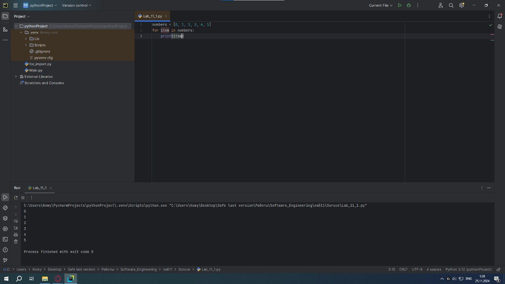
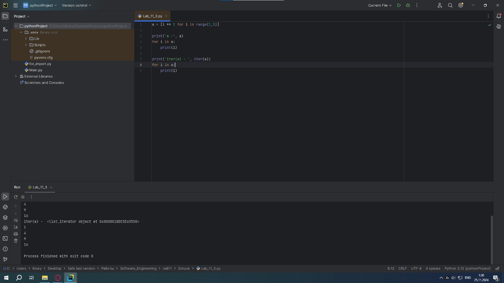
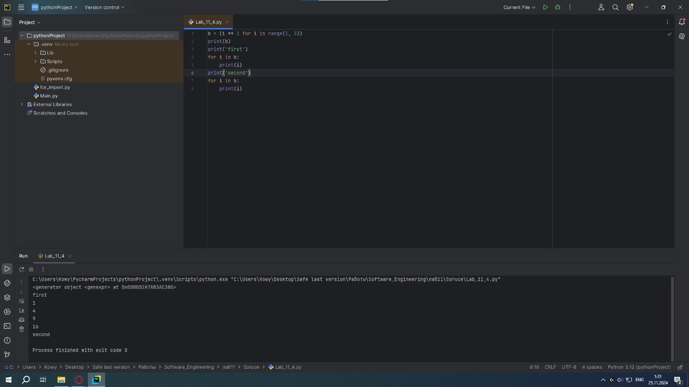
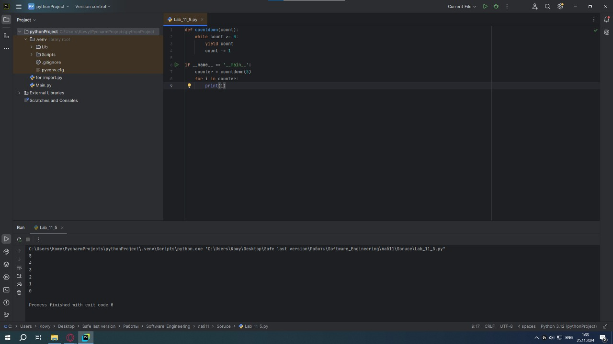
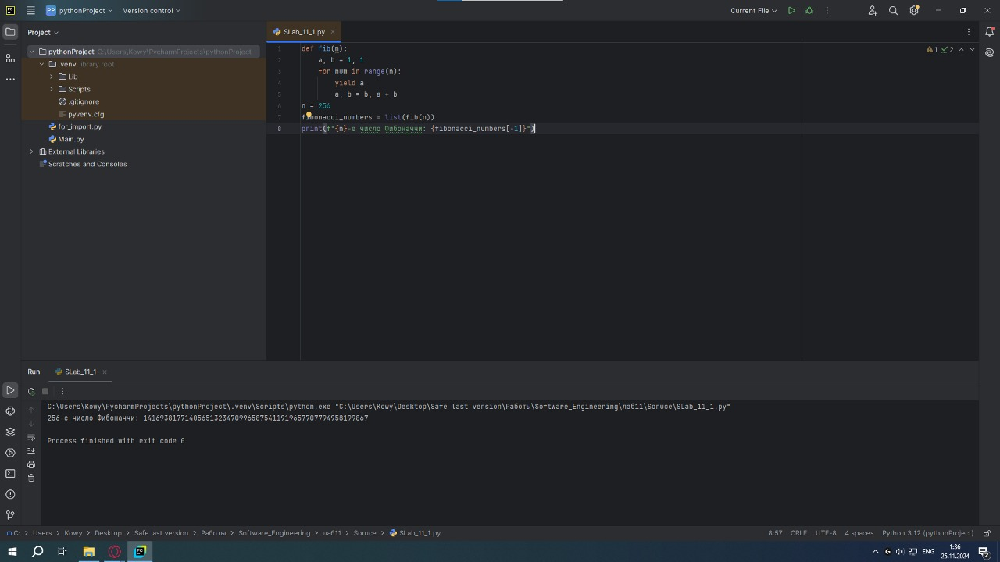
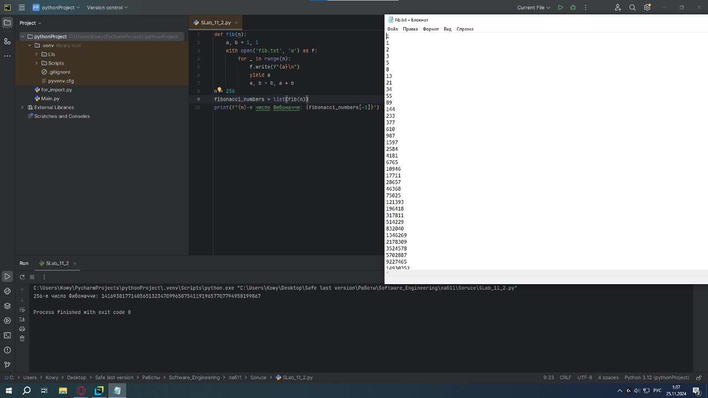

# Тема 11. Итераторы и генераторы
Отчет по Теме #11 выполнил(а):
- Кудренко Денис Валерьевич
- ИВТ-22-1

| Задание | Лаб_раб | Сам_раб |
| ------ | ------ |---------|
| Задание 1 | + | +       |
| Задание 2 | + | +       |
| Задание 3 | + | -       |
| Задание 4 | + | -       |
| Задание 5 | + | -       |

знак "+" - задание выполнено; знак "-" - задание не выполнено;

Работу проверили:
- к.э.н., доцент Панов М.А.

## Лабораторная работа №1
### Простой итератор, но у него нет гибкой настройки, например его нельзя развернуть. Он работает просто как next(), но нет prev()

```python
numbers = [0, 1, 2, 3, 4, 5]
for item in numbers:
    print(item)
```
### Результат.


## Выводы
Создали самый простой итератор в Python.

## Лабораторная работа №2
### Класс итератор с гибкой настройкой и удобными применением

```python
from itertools import count


class CountDown:
    def __init__(self, start):
        self.count = start + 1

    def __iter__(self):
        return self

    def __next__(self):
        self.count -= 1
        if self.count < 0:
            raise StopIteration
        return self.count

if __name__ == '__main__':
    counter = CountDown(5)
    for i in counter:
        print(i)
```
### Результат.


## Выводы
Создали итератор, который монжо настроить под свои задачи.

## Лабораторная работа №3
### Генератор списка

```python
a = [i ** 2 for i in range(1,5)]

print('a -', a)
for i in a:
    print(i)

print('iter(a) - ', iter(a))
for i in a:
    print(i)
```
### Результат.


## Выводы
Создали обычный генератор списка.

## Лабораторная работа №4
### Выражения генераторы

```python
b = (i ** 2 for i in range(1, 5))
print(b)
print('first')
for i in b:
    print(i)
print('second')
for i in b:
    print(i)
```
### Результат.


## Выводы
Создали генератор выражения.

## Лабораторная работа №5
### Такой же счетчик, как и в первом задании, только это генератор и использует yield

```python
def countdown(count):
    while count >= 0:
        yield count
        count -= 1

if __name__ == '__main__':
    counter = countdown(5)
    for i in counter:
        print(i)
```
### Результат.


## Выводы
Создали генератор, который использует yield.

## Самостоятельная работа №1
### Вас никак не могут оставить числа Фибоначчи, очень уж они вас заинтересовали. Изучив новые возможности Python вы решили реализовать программу, которая считает числа Фибоначчи при помощи итераторов. Расчет начинается с чисел 1 и 1. Создайте функцию fib(n), генерирующую n чисел Фибоначчи с минимальными затратами ресурсов. Для реализации этой функции потребуется обратиться к инструкции yield (Она не сохраняет в оперативной памяти огромную последовательность, а дает возможность “доставать” промежуточные результаты по одному). Результатом решения задачи будет листинг кода и вывод в консоль с числом Фибоначчи от 200

```python
def fib(n):
    a, b = 1, 1
    for num in range(n):
        yield a
        a, b = b, a + b
n = 256
fibonacci_numbers = list(fib(n))
print(f"{n}-е число Фибоначчи: {fibonacci_numbers[-1]}")
```
### Результат.


## Выводы
Создали программу, которая может высчитать число Фибоначчи при помощи итераторов.

## Самостоятельная работа №2
### К коду предыдущей задачи добавьте запоминание каждого числа Фибоначчи в файл “fib.txt”, при этом каждое число должно находиться на отдельной строчке. Результатом выполнения задачи будет листинг кода и скриншот получившегося файла

```python
def fib(n):
    a, b = 1, 1
    with open('fib.txt', 'w') as f:
        for _ in range(n):
            f.write(f"{a}\n")
            yield a
            a, b = b, a + b
n = 256
fibonacci_numbers = list(fib(n))
print(f"{n}-е число Фибоначчи: {fibonacci_numbers[-1]}")
```
### Результат.


## Выводы
Создали программу, которая может высчитать число Фибоначчи при помощи итераторов, а так-же программа записывает каждое число записывается в текстовый файл на отдельной строчке.
