# Тема 2. Базовые операции языка Python
Отчет по Теме #2 выполнил(а):
- Кудренко Денис Валерьевич
- ИВТ-22-1

| Задание | Лаб_раб | Сам_раб |
| ------ | ------ | ------ |
| Задание 1 | + | + |
| Задание 2 | + | + |
| Задание 3 | + | + |
| Задание 4 | + | + |
| Задание 5 | + | + |
| Задание 6 | + | + |
| Задание 7 | + | + |
| Задание 8 | + | + |
| Задание 9 | + | + |
| Задание 10 | + | + |

знак "+" - задание выполнено; знак "-" - задание не выполнено;

Работу проверили:
- к.э.н., доцент Панов М.А.

## Лабораторная работа №1
### Выведите в консоль три строки. Первая – любое число. Вторая – любое число в виде строки. Третья – любое число с плавающей точкой.

```python
print(256)
print('256')
print(2.56)
```
### Результат.
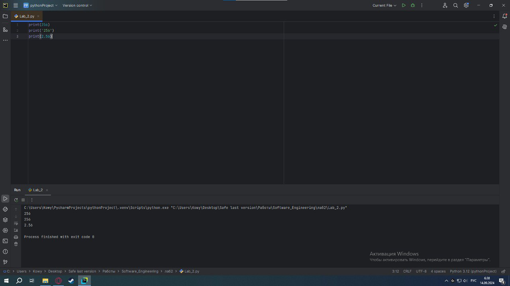

## Выводы
В данном коде выводятся три строки с использованием функции `print()`. Каждая строка содержит разные значения:

1. `print(256)`: Выводится целое число 256. Это число не взаимодействует со строковыми операциями и выводится как есть.

2. `print('256')`: Выводится строка '256', так как она заключена в одинарные кавычки. В этом случае это текстовая строка, а не число.

3. `print(2.56)`: Выводится число с плавающей точкой 2.56. Так же, как и в первом случае, оно выводится как числовое значение.

## Лабораторная работа №2
### Выведите в консоль три строки. Первая – результат сложения или вычитания минимум двух переменных типа int. Вторая – результат сложения или вычитания минимум двух переменных типа float. Третья – результат сложения или вычитания минимум двух переменных типа int и float.

```python
print(19977+381788)
print(8914.256-3201.64)
print(19977+381788-8914.256-3201.128)
```
### Результат.
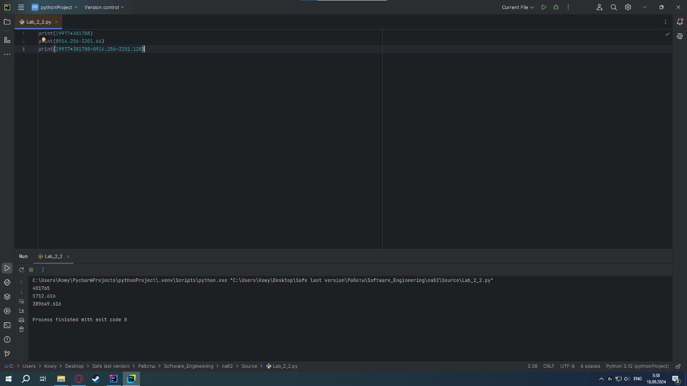

## Выводы
1. `print(19977+381788)`: В первом случае мы суммируем два числа с типом int
2. `print(8914.256-3201.64)`: Во втором случае вычисляется разность между числами с типом float
3. `print(19977+381788-8914.256-3201.128)`: В третьем случае одновременно проводим операции над числами с разными типами данных

## Лабораторная работа №3
### Выведите в консоль три строки. Первая – обычная строка. Вторая – F строка с использованием заранее объявленной переменной. Третья – сложите две или более строк в одну.

```python
print('Hello, world!')

world = 'world'
print(f"Hello, {world}!")

one = 'Hello, '
two = 'World!'
print(one + two)
```
### Результат.
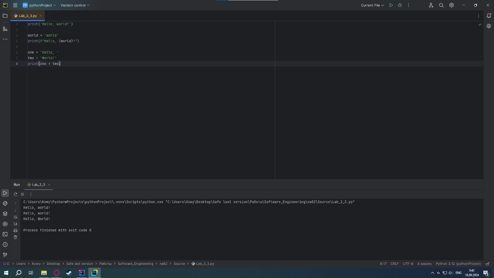

## Выводы
1. `print('Hello, world!')`: В первом случае мы просто выводим строку 
2. `print(f"Hello, {world}!")`: Во втором случае мы используем F-строку для переменной {world}
3. `print(one + two)`: В третьем случае мы создаем две переменных, присваеваем им значения и выводим их в виде строки.

## Лабораторная работа №4
### Выведите в консоль три строки. Первая – трансформация любого типа переменной в bool. Вторая – трансформация любого типа переменной в float или int. Третья – трансформация любого типа переменной в str.

```python
one = 'Python'
print (bool (one))

two = 256
print (float (two))

three = None
print(str (three))
```
### Результат.
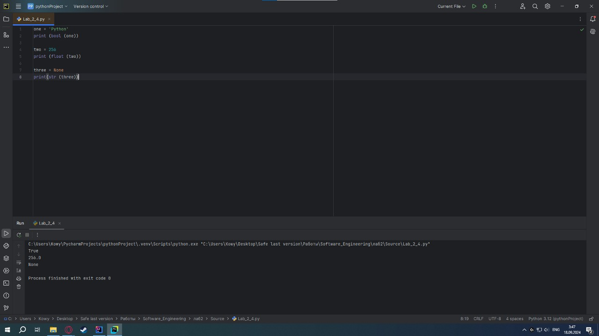

## Выводы
1. `print (bool (one))`: Конвертируем строку в булевый тип данных
2. `print (float (two))`: Выводит целое число в виде числа с плавающией точкой 
3. `print(str (three))`: Выводит строку с изначальным булевым типом данных

## Лабораторная работа №5
### Присвойте трем переменным различные значения, воспользовавшись функцией input()

```python
one = input('Первая переменная: ')
two = input('Вторая переменная: ')
three = input('Третья переменная: ')
print(one, two, three)
```
### Результат.
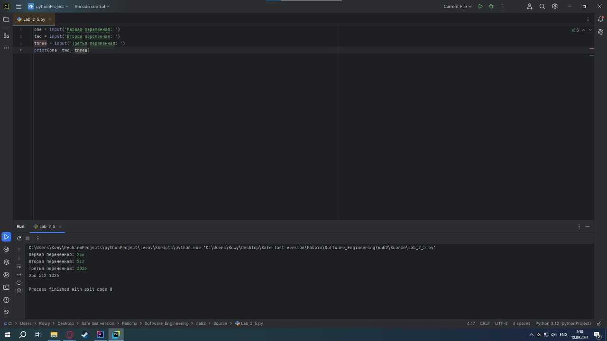

## Выводы
1.`one = input('Первая переменная: ')`: Присваеваем значение для переменной one
2.`two = input('Вторая переменная: ')`: Присваеваем значение для переменной two
3.`three = input('Третья переменная: ')`: Присваеваем значение для переменной three
4.`print(one, two, three)`: Выводим ранее присовенные значения 

## Лабораторная работа №6
### Создайте две любые числовые переменные и выполните над ними несколько математических операций: возведение в степень, обычное деление, целочисленное деление, нахождение остатка от деления. При желании вы можете проверить как работают эти вычисления с разными типами данных, например, сначала создать две переменные int, затем создать две переменные float и наконец создать переменные типа int и float и провести над ними операции, прописанные выше.

```python
a = 25
b = 2
print('Возведение в степень:', a ** b)
print('Обычное деление:', a / b)
print('Целочисленное деление:', a // b)
print('Нахождение остатка от деления:', a % b)
```
### Результат.
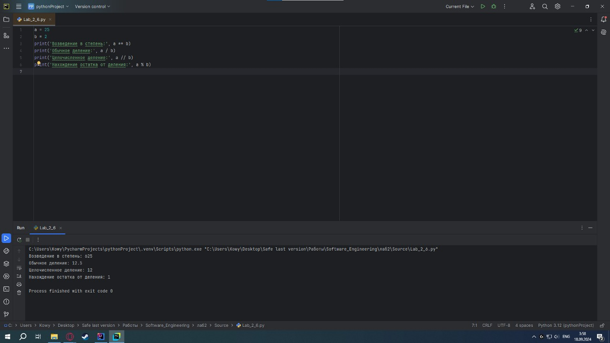

## Выводы
Производим  базовые математические операции над переменными a и b

## Лабораторная работа №7
### Создайте любую строковую переменную и произведите над ней математическое действие умножение на любое число.

```python
line = 'Привет мир! '
print(line * 10)
```
### Результат.
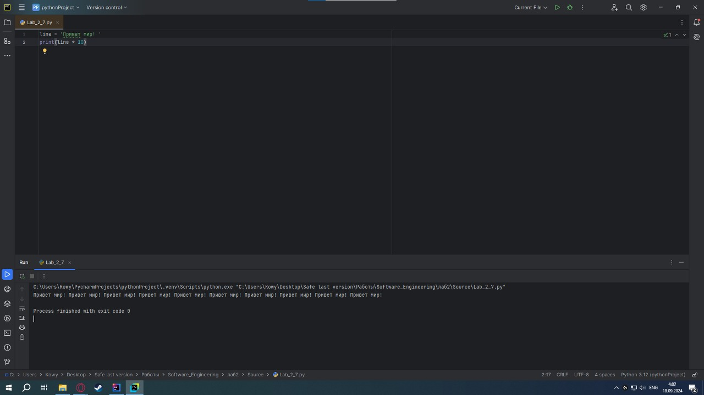

## Выводы
`print(line * 10)`: В данном примере мы умножаем изначальную строчку на 10

## Лабораторная работа №8
### Посчитайте сколько раз символ ‘и’ встречается в строке ‘Привет мир!’.

```python
line = 'Привет мир! '
print(line.count('и'))
```
### Результат.


## Выводы
`print(line.count('и'))`: Данный код считает количество букв 'и' в изначальной строчке

## Лабораторная работа №9
### Напишите предложение ‘Привет мир’ в две строки. Написанная программа должна занимать одну строку в редакторе кода.

```python
print('Привет\nМир')
```
### Результат.


## Выводы
`print('Привет\nМир')`: Часть '\n' выполняет перенос на следующую строчку 

## Лабораторная работа №10
### Из предложения ‘Привет мир’ выведите в консоль только 2 символ, а затем выведите слово ‘Привет’

```python
line = 'Привет мир'
print(line[1])
print(line[:6])
```
### Результат.
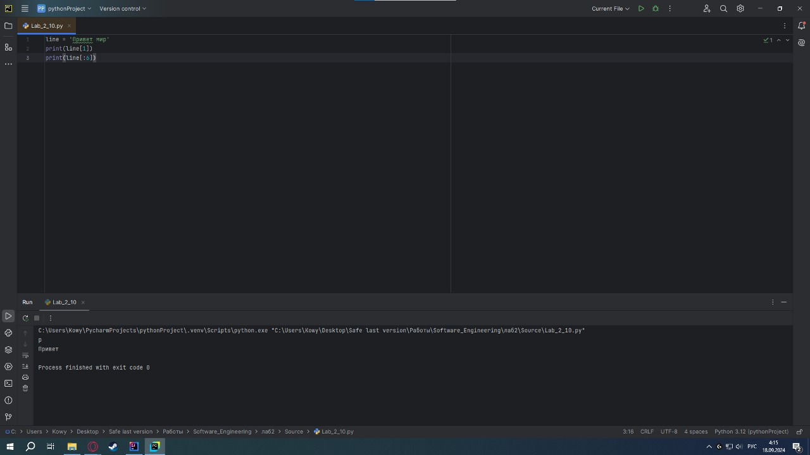

## Выводы
1. `print(line[1])`: Выводит только второй символ из строки
2. `print(line[:6])`: Выводит первые 6 символов из строки

## Самостоятельная работа №1
### Выведите в консоль булевую переменную False, не используя слово False в строке или изначально присвоенную булевую переменную. Программа должна занимать не более двух строк редактора кода.

```python
print(not True)
```
### Результат.
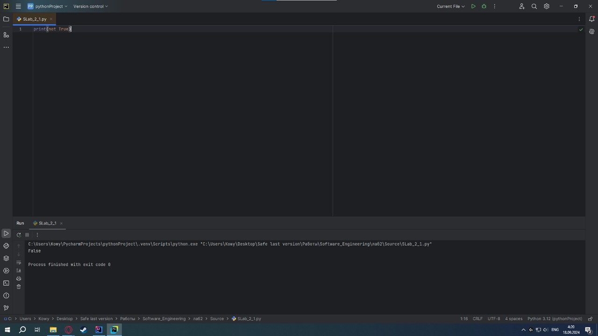

## Выводы
`print(not True)`: Выводим False через отрицание True

## Самостоятельная работа №2
### Присвоить значения трем переменным и вывести их в консоль, используя только две строки редактора кода

```python
one, two, three = 5, 10, 15
print(one,two,three)
```
### Результат.
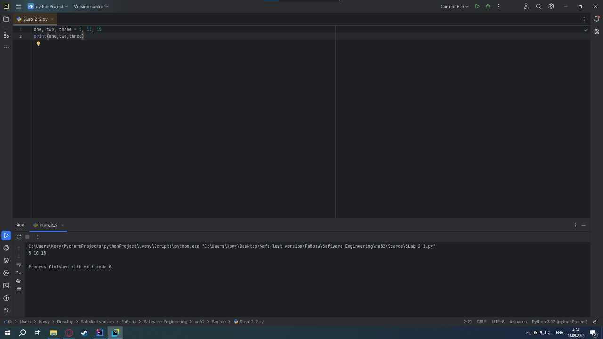

## Выводы
`print(one,two,three)`: Выводим записанные ранее переменные 

## Самостоятельная работа №3
### Реализуйте ввод данных в программу, через консоль, в виде только целых чисел (тип данных int). То есть при вводе буквенных символов в консоль, программа не должна работать. Программа должна занимать не более двух строк редактора кода.

```python
intinput = int(input())
print(intinput)
```
### Результат.


## Выводы
1. `intinput = int(input())`: Проверка на тип вводимых данных
2. `print(intinput)`: Вывод целочисленных значений, которые мы ввели

## Самостоятельная работа №4
### Создайте только одну строковую переменную. Длина строки должна не превышать 5 символов. На выходе мы должны получить строку длиной не менее 16 символов. Программа должна занимать не более двух строк редактора кода.

```python
line = 'cat'
print(line * 6)
```
### Результат.


## Выводы
`print(line * 6)`: Умножаем изначальную строчку в 6 раз

## Самостоятельная работа №5
### Создайте три переменные: день (тип данных - числовой), месяц (тип данных - строка), год (тип данных - числовой) и выведите в консоль текущую дату в формате: “Сегодня день месяц год. Всего хорошего!” используя F строку и оператор end внутри print(), в котором вы должны написать фразу “Всего хорошего!”. Программа должна занимать не более двух строк редактора кода.

```python
day, month, year = 18,"сентября",2024
print(f"Сегодня {day} {month} {year} ", end="Всего хорошего!")
```
### Результат.
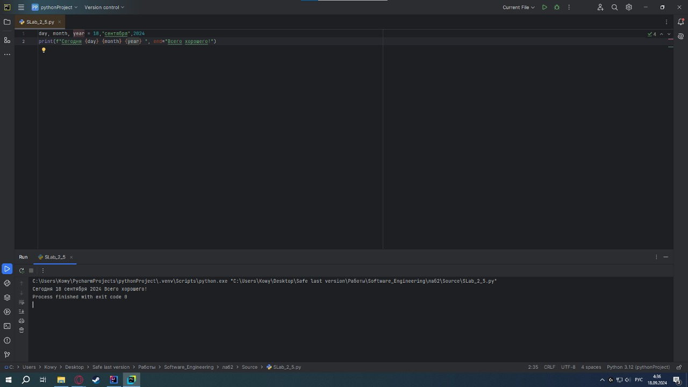

## Выводы
1. `day, month, year = 18,"сентября",2024`: Присваиваем значения переменным day, month, year
2. `print(f"Сегодня {day} {month} {year} ", end="Всего хорошего!")`: Выводим их через F-строку

## Самостоятельная работа №6
### Создайте три переменные: день (тип данных - числовой), месяц (тип данных - строка), год (тип данных - числовой) и выведите в консоль текущую дату в формате: “Сегодня день месяц год. Всего хорошего!” используя F строку и оператор end внутри print(), в котором вы должны написать фразу “Всего хорошего!”. Программа должна занимать не более двух строк редактора кодаВ предложении ‘Hello World’ вставьте ‘my’ между двумя словами. Выведите полученное предложение в консоль в одну строку. Программа должна занимать не более двух строк редактора кода.

```python
line = "Hello World"
print(line[:5] + " my " + line[-5:])
```
### Результат.
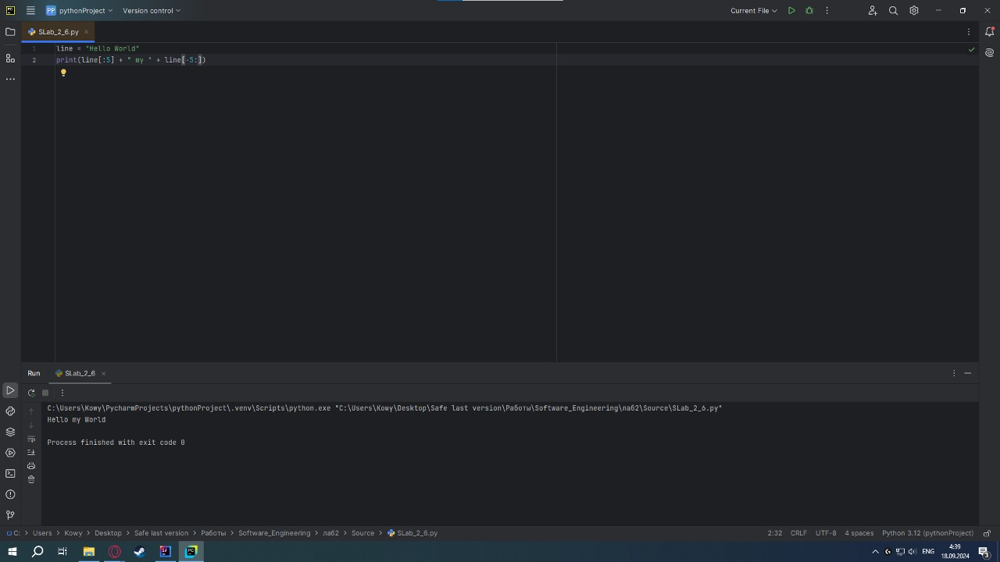

## Выводы
`print(line[:5] + " my " + line[-5:])`: Сначало выводим первые 5 символов строки, потом добавляем к ним 'my', после чего добавляем последние 5 символов

## Самостоятельная работа №7
### Узнайте длину предложения ‘Hello World’, результат выведите в консоль. Программа должна занимать не более двух строк редактора кода.

```python
print(len('Hello World'))
```
### Результат.


## Выводы
`print(len('Hello World'))`: Выводит длинну изначальной строки 'Hello World'

## Самостоятельная работа №8
### Переведите предложение ‘HELLO WORLD’ в нижний регистр. Программа должна занимать не более двух строк редактора кода.

```python
print("HELLO WORLD".lower())
```
### Результат.


## Выводы
`print("HELLO WORLD".lower())`: Переводит строчку 'Hello World' в нижний регистр

## Самостоятельная работа №9
### Самостоятельно придумайте задачу по проходимой теме и решите ее. Задача должна быть связана со взаимодействием с числовыми значениями.

```python
num1 = float(input())
num2 = float(input())
average = (num1 + num2) / 2
print(average)
```
### Результат.
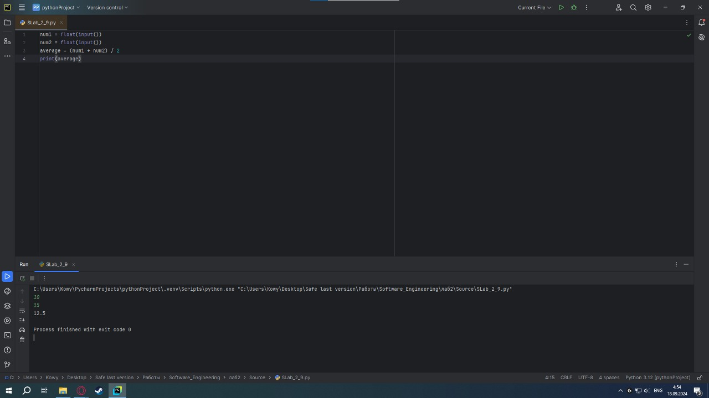

## Выводы
Данный код нужен для нахождения среднего арифметичского числа

## Самостоятельная работа №10
### Самостоятельно придумайте задачу по проходимой теме и решите ее. Задача должна быть связанна со взаимодействием со строковыми значениями.

```python
user_input = input("Введите строку: ")
count_a = user_input.lower().count('a')
print(f"Количество букв 'a' в строке: {count_a}")
```
### Результат.
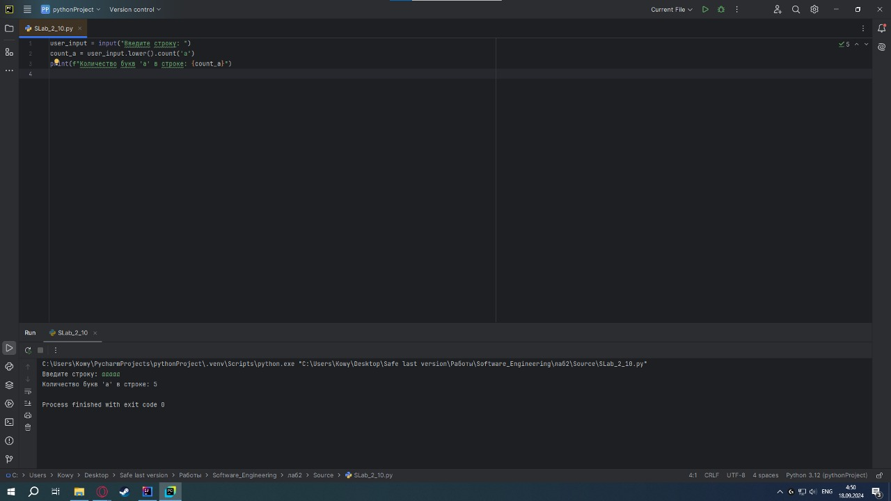

## Выводы
Подсчитывает количество букв 'а' в строке, которую вводит пользователь
