# Тема 5. Базовые коллекции: строки и списки
Отчет по Теме #5 выполнил(а):
- Кудренко Денис Валерьевич
- ИВТ-22-1

| Задание | Лаб_раб | Сам_раб |
| ------ | ------ |---------|
| Задание 1 | + | +       |
| Задание 2 | + | +       |
| Задание 3 | + | +       |
| Задание 4 | + | +       |
| Задание 5 | + | +       |
| Задание 6 | + | -       |
| Задание 7 | + | -       |
| Задание 8 | + | -       |
| Задание 9 | + | -       |
| Задание 10 | + | -       |

знак "+" - задание выполнено; знак "-" - задание не выполнено;

Работу проверили:
- к.э.н., доцент Панов М.А.

## Лабораторная работа №1
### Друзья предложили вам поиграть в игру “найди отличия и убери повторения (версия для программистов)”. Суть игры состоит в том, что на вход программы поступает два множества, а ваша задача вывести все элементы первого, которых нет во втором. А вы как раз недавно прошли множества и знаете их возможности, поэтому это не составит для вас труда.

```python
set_1 = {'White', 'Black', 'Red', 'Pink'}
set_2 = {'Red', 'Green', 'Blue', 'Red'}
print('1', set_1 - set_2)

set_1 = {'White', 'Black', 'Red', 'Pink'}
set_2 = {'Red', 'Green', 'Blue', 'Red'}
print('2', set_1 - set_2)

set_1 = {'White', 'Black', 'Red', 'Pink'}
set_2 = {'Red', 'Green', 'Blue', 'Red'}
print('3', set_1 - set_2)
```
### Результат.
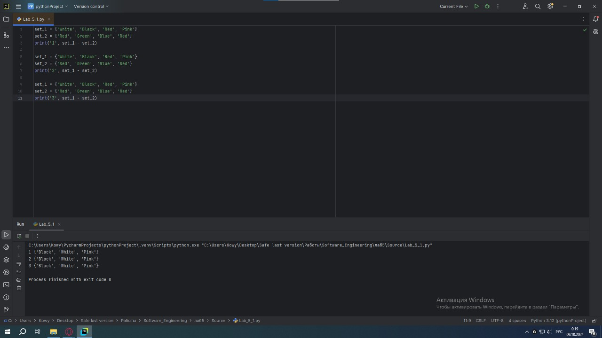

## Выводы
Научились вызывать функцию использую "точку входа"

## Лабораторная работа №2
### Напишите две одинаковые программы, только одна будет использовать set(), а вторая frozenset() и попробуйте к исходному множеству добавить несколько элементов, например, через цикл.

```python
a = set('abcdefg')
print(a)
for i in range(1,5):
    a.add(i)
print(a)
```
### Результат.
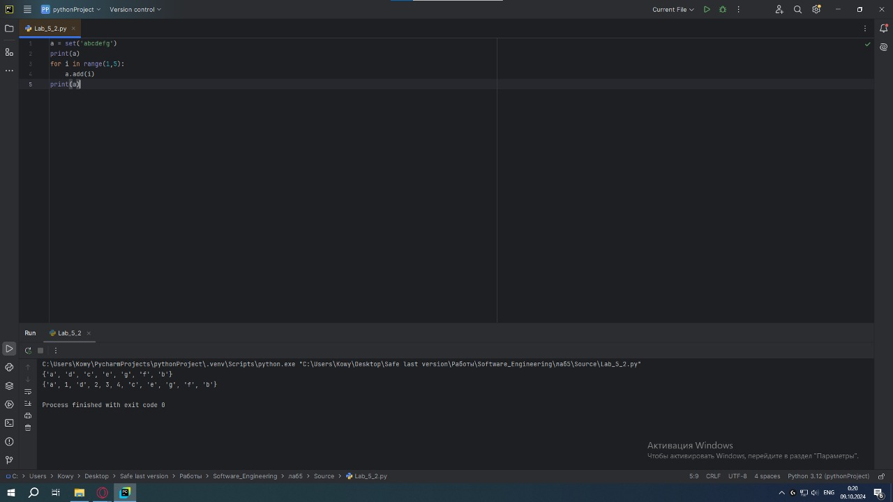

## Выводы
Оптимизировали скорость работы предыдущей программы

## Лабораторная работа №3
### На вход в программу поступает список (минимальной длиной 2 символа). Напишите программу, которая будет менять первый и последний элемент списка.

```python
def replace(input_list):
    memory = input_list[0]
    input_list[0] = input_list[-1]
    input_list[-1] = memory

    return  input_list
print(replace([1,2,3,4,5]))
```
### Результат.
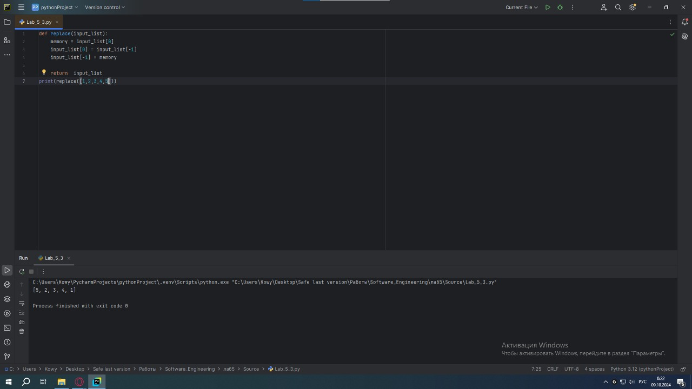

## Выводы
Создали функцию с двумя аргументами

## Лабораторная работа №4
### На вход в программу поступает список (минимальной длиной 10 символов). Напишите программу, которая выводит элементы с индексами от 2 до 6. В программе необходимо использовать “срез”.

```python
a = [12, 54, 32, 57, 843, 2346, 765, 75, 25, 234, 756, 23]
print(a[2:6])
```
### Результат.
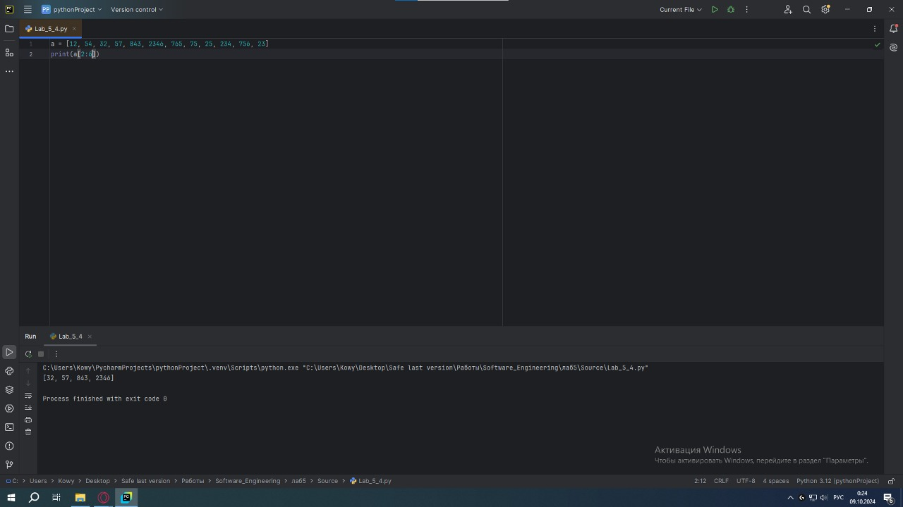

## Выводы
Создали функцию с двумя аргументами, но второй из них уже является массивом

## Лабораторная работа №5
### Иван задумался о поиске «бесполезного» числа, полученного из списка. Суть поиска в следующем: он берет произвольный список чисел, находит самое большое из них, а затем делит его на длину списка. Студент пока не придумал, где может пригодиться подобное значение, но ищет у вас помощи в реализации такой функции useless().

```python
def useless(lst):
    return max(lst) / len(lst)
print(useless([3, 5, 7, 3, 33]))
print(useless([-12.5, 54, 77.3, 0, -36, 98.2, -63, 21.7, 47, -89.6]))
print(useless([-25.8, 86, 12.5, -56, 73.2, 0, 43, -91.5, 65.9, -7]))
```
### Результат.
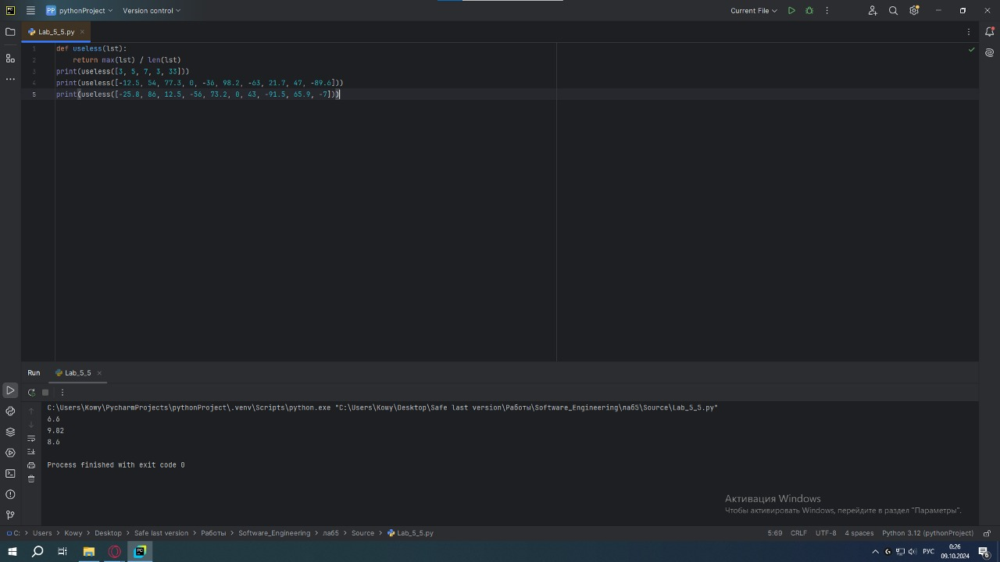

## Выводы
1. def main(**kwargs): функция с картежом в качестве аргумента
2. for i in kwargs.items(): проходимся по предметам
3. for key in kwargs: проходимся по ключам

## Лабораторная работа №6
### Ребята не могут определится каким супергероем они хотят стать. У них есть случайно составленный список супергероев, и вы должны определить кто из ребят будет каким супергероем. Необходимо использовать разделение списков.

```python
superheroes = ['superman', 'spiderman', 'batman']
nikolay, vasiliy, ivan = superheroes
print('Николай - ', nikolay)
print('Василий - ', vasiliy)
print('Иван - ', ivan)
```
### Результат.
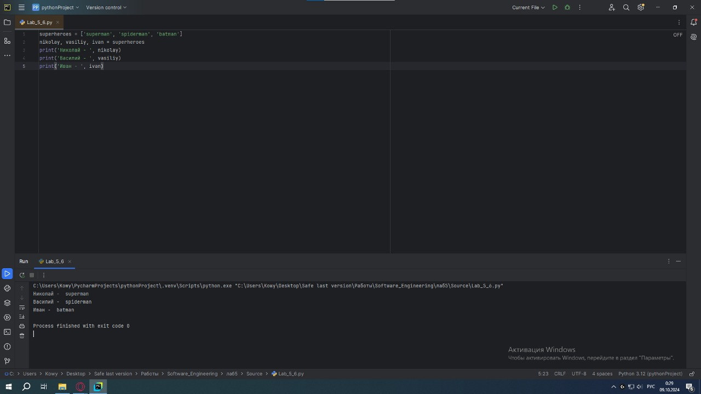

## Выводы
Научились использовать функцию с картежом в качестве аргумента

## Лабораторная работа №7
### Вовочка, насмотревшись передачи “Слабое звено” решил написать программу, которая также будет находить самое слабое звено (минимальный элемент) и удалять его, только делать он это хочет не с людьми, а со списком. Помогите Вовочке с реализацией программы.

```python
a = [-25.8, 86, 12.5, -56, 73.2, 0, 43, -91.5, 65.9, -7]
a.sort()
print('Отсортированный список:\n',a)
a.pop(0)
print('Отсортированный список без наименьшего элемента:\n', a)
```
### Результат.
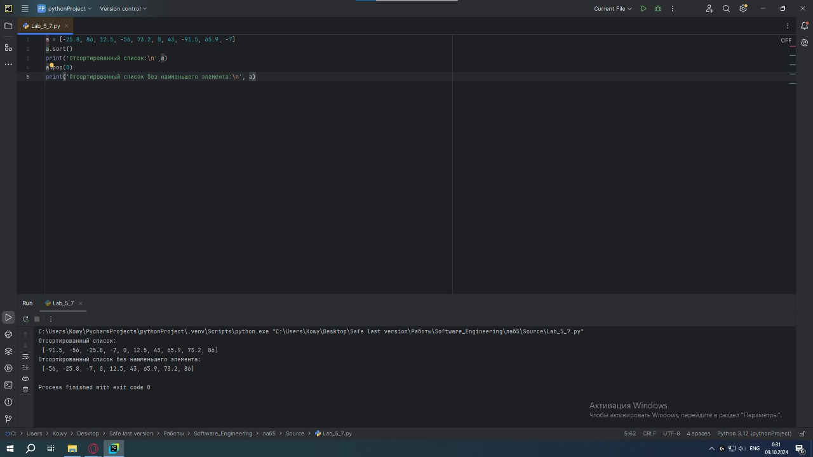

## Выводы
Научились импортировать метод из одного в другой

## Лабораторная работа №8
### Михаил решил создать большой n-мерный список, для этого он случайным образом создал несколько списков, состоящих минимум из 3, а максимум из 10 элементов и поместил их в один большой список. Он также как и Иван не знает зачем ему это сейчас нужно, но надеется на то, что это пригодится ему в будущем.

```python
from random import randint
def list_maker():
    a = [randint(1, 100)] * randint(3,10)
    return a
if __name__ == '__main__':
    result = []
    for i in range(randint(1,5)):
        result.append(list_maker())
        print(result)
```
### Результат.
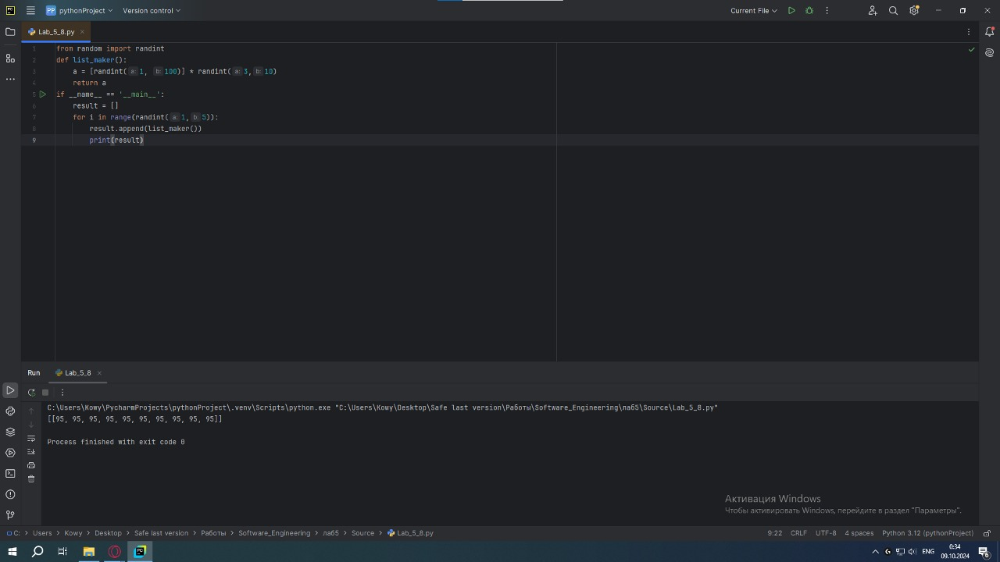

## Выводы
Импортируем базовую функцию math из python

## Лабораторная работа №9
### Вы работаете в ресторане и отвечает за статистику покупок, ваша задача сравнить между собой заказы покупателей, которые указаны в разном порядке. Реализуйте функцию superset(), которая принимает 2 множества. Результат работы функции: вывод в консоль одного из сообщений в зависимости от ситуации: 1 - «Супермножество не обнаружено» 2 – «Объект {X} является чистым супермножеством» 3 – «Множества равны»

```python
def superset(set_1, set_2):
    if set_1 > set_2:
        print(f'Обьект {set_1} является чистым супермножеством')
    elif set_1 == set_2:
        print(f'Множества равны')
    elif set_1 < set_2:
        print(f'Обьект {set_2} является чистым супермножеством')
    else:
        print('Супермножество не обнаружено')
if __name__ == '__main__':
    superset({1,8,3,5}, {3,5})
    superset({1,8,3,5}, {5,3,8,1})
    superset({3,5}, {5,3,8,1})
    superset({90,100}, {3,5})
```
### Результат.
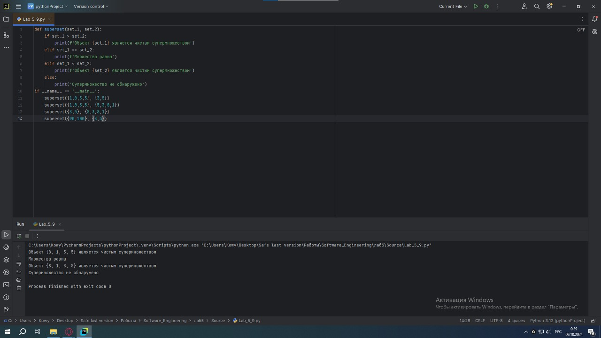

## Выводы
Научились импортировать datatime и timedelta, а также давать им псевдонимы

## Лабораторная работа №10
### Предположим, что вам нужно разобрать стопку бумаг, но нужно начать работу с нижней, “переверните стопку”. Вам дан произвольный список. Представьте его в обратном порядке. Программа должна занимать не более двух строк в редакторе кода.

```python
my_list = [2, 5, 8, 3]
print(my_list[::-1])
```
### Результат.
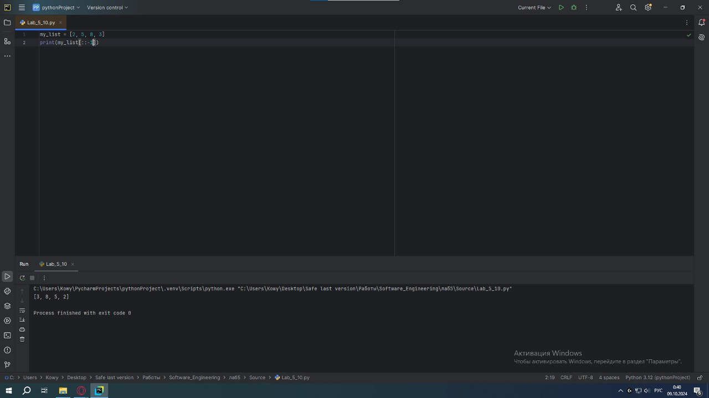

## Выводы
Создаем две функции, после чего вызываем их

## Самостоятельная работа №1
### Ресторан на предприятии ведет учет посещений за неделю при помощи кода работника. У них есть список со всеми посещениями за неделю. Ваша задача почитать: 
### • Сколько было выдано чеков 
### • Сколько разных людей посетило ресторан 
### • Какой работник посетил ресторан больше всех раз

```python
from collections import Counter
list = [8734, 2345, 8201, 6621, 9999, 1234, 5678, 8201, 8888, 4321, 3365, 1478, 9865, 5555, 7777, 9998, 1111, 2222, 3333, 4444, 5556, 6666, 5410, 7778, 8889, 4445, 1439, 9604, 8201, 3365, 7502, 3016, 4928, 5837, 8201, 2643, 5017, 9682, 8530, 3250, 7193, 9051, 4506, 1987, 3365, 5410, 7168, 7777, 9865, 5678, 8201, 4445, 3016, 4506, 4506]
print(len(list))
print(len(set(list)))
print(Counter(list).most_common(1)[0][0])
```
### Результат.
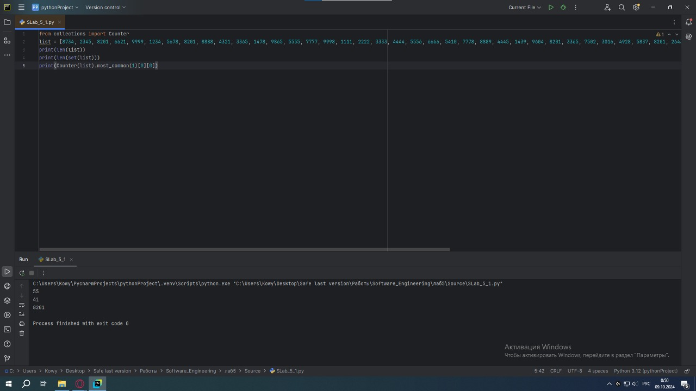

## Выводы
Расписали каждую строчку кода, согласно тексту задания

## Самостоятельная работа №2
### На физкультуре студенты сдавали бег, у преподавателя физкультуры есть список всех результатов, ему нужно узнать 
### • Три лучшие результата 
### • Три худшие результата 
### • Все результаты начиная с 10

```python
list = [10.2, 14.8, 19.3, 22.7, 12.5, 33.1, 38.9, 21.6, 26.4, 17.1, 30.2, 35.7, 16.9, 27.8, 24.5, 16.3, 18.7, 31.9, 12.9, 37.4]
list_sorted = sorted(list)

print(list_sorted[0:4])
print(list_sorted[-3:])
print(list[10:])
```
### Результат.
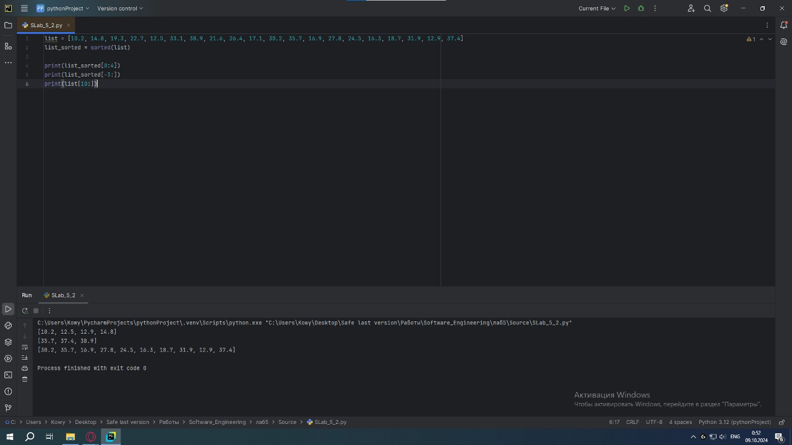

## Выводы
Написали программу, которая имитирует бросание 6 гранного кубика при помощии функции "точка входа"

## Самостоятельная работа №3
### Преподаватель по математике придумал странную задачу. У вас есть три списка с элементами, каждый элемент которых – длина стороны треугольника, ваша задача найти площади двух треугольников, составленные из максимальных и минимальных элементов полученных списков. Результатом выполнения задачи будет: листинг кода, и вывод в консоль, в котором будут указаны два этих значения.

```python
from math import sqrt

one = [12, 25, 3, 48, 71]
two = [5, 18, 40, 62, 98]
three = [4, 21, 37, 56, 84]

mp = (max(one) + max(two) +max(three)) / 2
mip = (min(one) + min(two) +min(three)) / 2

max_square = sqrt(mp * (mp - max(one)) * (mp - max(two)) * (mp - max(three)))
min_square = sqrt(mip * (mip - min(one)) * (mip - min(two)) * (mip - min(three)))

print(max_square)
print(min_square)
```
### Результат.
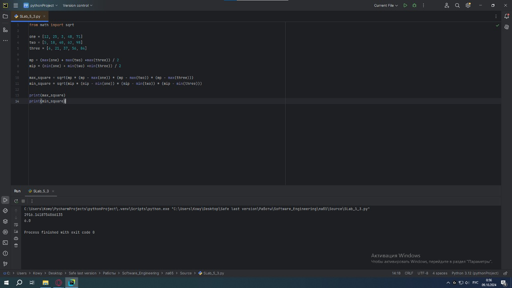

## Выводы
Написали программу, которая указывает текущее время с интервалом 1 секунду в течении 5 секунд

## Самостоятельная работа №4
### Никто не любит получать плохие оценки, поэтому Борис решил это исправить. Допустим, что все оценки студента за семестр хранятся в одном списке. Ваша задача удалить из этого списка все двойки, а все тройки заменить на четверки.

```python
first = [2, 3, 4, 5, 3, 4, 5, 2, 2, 5, 3, 4, 3, 5, 4]
second = [4, 2, 3, 5, 3, 5, 4, 2, 2, 5, 4, 3, 5, 3, 4]
third = [5, 4, 3, 3, 4, 3, 3, 5, 5, 3, 3, 3, 3, 4, 4]

def modify_grades(grades):
    return [4 if grade == 3 else grade for grade in grades if grade != 2]

print(modify_grades(first))
print(modify_grades(second))
print(modify_grades(third))
```
### Результат.
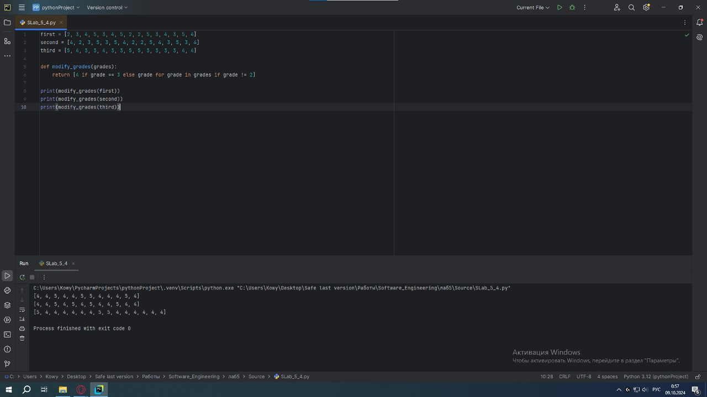

## Выводы
Написали программу, которая высчитывает среднее арефметическое и выводит на экран при помощи функции "точка входа"

## Самостоятельная работа №5
### Вам предоставлены списки натуральных чисел, из них необходимо сформировать множества. При этом следует соблюдать это правило: если какое-либо число повторяется, то преобразовать его в строку по следующему образцу: например, если число 4 повторяется 3 раза, то в множестве будет следующая запись: само число 4, строка «44», строка «444».

```python
list_1 = [1, 1, 3, 3, 1]
list_2 = [5, 5, 5, 5, 5, 5, 5]
list_3 = [2, 2, 1, 2, 2, 5, 6, 7, 1, 3, 2, 2]


def list_to_set(lst):
    result_set = set()
    counts = {}

    for num in lst:
        counts[num] = counts.get(num, 0) + 1

    for num, count in counts.items():
        result_set.add(num)
        for i in range(2, count + 1):
            result_set.add(str(num) * i)

    return result_set

print(list_to_set(list_1))
print(list_to_set(list_2))
print(list_to_set(list_3))
```
### Результат.
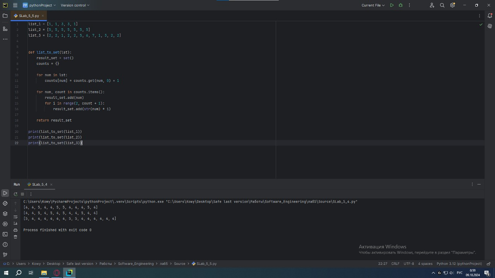

## Выводы
Написали программу согласно текстовому заданию, создав 2 Python в один из которых мы импортировали метод
