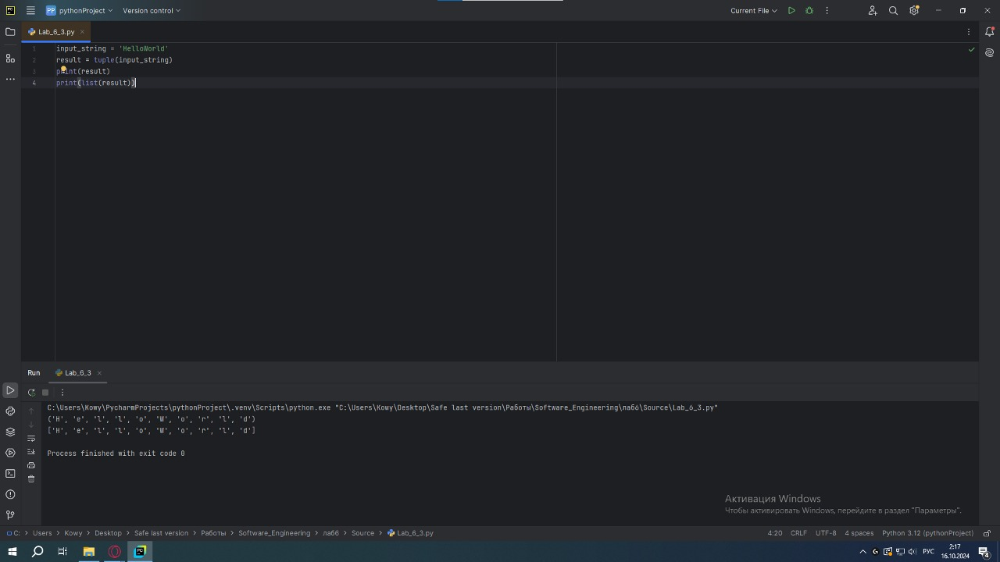
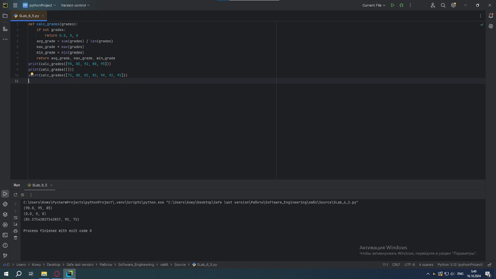

# Тема 6. Базовые коллекции: словари, кортежи
Отчет по Теме #6 выполнил(а):
- Кудренко Денис Валерьевич
- ИВТ-22-1

| Задание | Лаб_раб | Сам_раб |
| ------ | ------ |---------|
| Задание 1 | + | +       |
| Задание 2 | + | +       |
| Задание 3 | + | +       |
| Задание 4 | + | +       |
| Задание 5 | + | +       |

знак "+" - задание выполнено; знак "-" - задание не выполнено;

Работу проверили:
- к.э.н., доцент Панов М.А.

## Лабораторная работа №1
### В школе, где вы учились, узнали, что вы крутой программист и попросили написать программу для учителей, которая будет при вводе кабинета писать для него ключ доступа и статус, занят кабинет или нет. При написании программы необходимо использовать словарь (dict), который на вход получает номер кабинета, а выводит необходимую информацию. Если кабинета, который вы ввели нет в словаре, то в консоль в виде значения ключа нужно вывести “None” и виде статуса вывести “False”.

```python
request = int(input('Введите номер кабинета: '))

dictionary = {
    101: {'key': 1234, 'access': True},
    102: {'key': 1337, 'access': True},
    103: {'key': 8943, 'access': True},
    104: {'key': 5555, 'access': False},
    None: {'key': None, 'access': False},
}

response = dictionary.get(request)
if not response:
    response = dictionary[None]
key = response.get('key')
access = response.get('access')
print(key, access)
```
### Результат.


## Выводы
Научились заменять иногда громоздкую конструкцию if/elif/else поскольку, здесь функционал словаря полностью повторяет функционал условия

## Лабораторная работа №2
### Алексей решил создать самый большой словарь в мире. Для этого он придумал функцию dict_maker (**kwargs), которая принимает неограниченное количество параметров «ключ: значение» и обновляет Михаил А. Панов созданный им словарь my_dict, состоящий всего из одного элемента «first» со значением «so easy». Помогите Алексею создать данную функцию.

```python
from pprint import pprint

my_dict = {'first': 'so easy'}

def dict_maker(**kwargs):
    my_dict.update(**kwargs)

dict_maker(a1=1, a2=20, a3=54, a4=13)
dict_maker(name='Михаил', age=31, weight=70, eyes_color='blue')
pprint(my_dict)
```
### Результат.


## Выводы
Мы использовали встроенный модуль pprint,который выводит большие объемы информации более понятно длявосприятия человеческим глазом. Иногда очень удобно использовать данную возможность Python.

## Лабораторная работа №3
### Для решения некоторых задач бывает необходимо разложить строку на отдельные символы. Мы знаем что это можно сделать при помощи split(), у которого более гибкая настройка для разделения для этого, но если нам нужно посимвольно разделить строку без всяких условий, то для этого мы можем использовать кортежи (tuple). Для этого напишем любую строку, которую будем делить и “обвернем” ее в tuple и дальше мы можем как нам угодно с ней работать, например, сделать ее списком (тогда получится полный аналог split()) или же работать с ним дальше, как с кортежем.

```python
input_string = 'HelloWorld'
result = tuple(input_string)
print(result)
print(list(result))
```
### Результат.


## Выводы
Мы можем как нам угодно с ней работать, например, сделать ее списком (тогда получится полный аналог split()) или же работать с ним дальше, как с кортежем.

## Лабораторная работа №4
### Вовочка решил написать крутую функцию, которая будет писать имя, возраст и место работы, но при этом на вход этой функции будет поступать кортеж. Помогите Вовочке написать эту программу.
```python
def personal_info(name, age, company='unnamed'):
    print(f"Имя: {name} Возраст: {age} Компания: {company}")
tom = ("Григорий", 22)
personal_info(*tom)
bob = ("Георгий", 41, "Yandex")
personal_info(*bob)
```
### Результат.


## Выводы
Написали функцию, которая принимает на вход данные в виде кортежа

## Лабораторная работа №5
### Для сопровождения первых лиц государства X нужен кортеж, но никто не может определиться с порядком машин, поэтому вам нужно написать функцию, которая будет сортировать кортеж, состоящий из целых чисел по возрастанию, и возвращает его. Если хотя бы один элемент не является целым числом, то функция возвращает исходный кортеж.

```python
def tuple_sort(tpl):
    for elm in tpl:
        if not isinstance(elm, int):
            return tpl
    return tuple(sorted(tpl))
if __name__ == '__main__':
    print(tuple_sort((5, 5, 3, 1, 9)))
    print(tuple_sort((5, 5, 2.1, '1', 9)))
```
### Результат.


## Выводы
Написали функцию, которая будет сортировать кортеж, состоящий из целых чисел по возрастанию, и возвращает его. Если хотя бы один элемент не является целым числом, то функция возвращает исходный кортеж.

## Самостоятельная работа №1
### При создании сайта у вас возникла потребность обрабатывать данные пользователя в странной форме, а потом переводить их в нужные вам форматы. Вы хотите принимать от пользователя последовательность чисел, разделенных пробелом, а после переформатировать эти данные в список и кортеж. Реализуйте вашу задумку.

```python
user_input = input()
numbers_list = [int(num) for num in user_input.split()]
numbers_tuple = tuple(numbers_list)
print("Список чисел:", numbers_list)
print("Кортеж чисел:", numbers_tuple)
```
### Результат.


## Выводы
Принимаем последовательность от пользователя в виде чисел, разделённых пробелом, после чего форматируем эти данные в виде кортежа и списка

## Самостоятельная работа №2
### Николай знает, что кортежи являются неизменяемыми, но он очень упрямый и всегда хочет доказать, что он прав. Студент решил создать функцию, которая будет удалять первое появление определенного элемента из кортежа по значению и возвращать кортеж без него. Попробуйте повторить шедевр не признающего авторитеты начинающего программиста. Но учтите, что Николай не всегда уверен в наличии элемента в кортеже.

```python
def remove_element(tup, element):
    if element not in tup:
        return tup
    new_tup = list(tup)
    new_tup.remove(element)
    return tuple(new_tup)
print(remove_element((1, 2, 3), 1))  # (2, 3)
```
### Результат.


## Выводы
Написали функцию, которая удаляет первое появление определенного элемента из кортежа по значению и возвращает кортеж без него

## Самостоятельная работа №3
### Ребята поспорили кто из них одним нажатием на numpad наберет больше повторяющихся цифр, но не понимают, как узнать победителя. Вам им нужно в этом помочь. Дана строка в виде случайной последовательности чисел от 0 до 9 (длина строки минимум 15 символов). Требуется создать словарь, который в качестве ключей будет принимать данные числа (т. е. ключи будут типом int), а в качестве значений – количество этих чисел в имеющейся последовательности.

```python
def count_digits(digits_str):
    digit_counts = {}
    for digit in digits_str:
        if digit.isdigit():
            digit_int = int(digit)
            if digit_int in digit_counts:
                digit_counts[digit_int] += 1
            else:
                digit_counts[digit_int] = 1
    top_3 = sorted(digit_counts.items(), key=lambda x: x[0])[:3]
    return dict(top_3)
digits_str1 = "1234567890123456"
print(count_digits(digits_str1))
```
### Результат.


## Выводы
Написали программу, которая считает количество каждого элемента, после чего находит 3 самых часто встречающихся числа и сортирует по возрастанию чисел

## Самостоятельная работа №4
### Ваш хороший друг владеет офисом со входом по электронным картам, ему нужно чтобы вы написали программу, которая показывала в каком порядке сотрудники входили и выходили из офиса. Определение сотрудника происходит по id. Напишите функцию, которая на вход принимает кортеж и случайный элемент (id), его можно придумать самостоятельно. Требуется вернуть новый кортеж, начинающийся с первого появления элемента в нем и заканчивающийся вторым его появлением включительно.

```python
def get_sliced_tuple(tup, element):
    if element not in tup:
        return ()

    first_index = tup.index(element)
    try:
        last_index = tup.index(element, first_index + 1)
        return tup[first_index:last_index + 1]
    except ValueError:
        return tup[first_index:]
print(get_sliced_tuple((1, 8, 3, 4, 8, 8, 9, 2), 8))
```
### Результат.


## Выводы
Написали программу, которая возвращает кортеж от заданого числа до повторного появления этого числа в этом же кортеже.

## Самостоятельная работа №5
### Самостоятельно придумайте и решите задачу, в которой будут обязательно использоваться кортеж или список. Проведите минимум три теста для проверки работоспособности вашей задачи.

```python
def calc_grades(grades):
    if not grades:
        return 0.0, 0, 0
    avg_grade = sum(grades) / len(grades)
    max_grade = max(grades)
    min_grade = min(grades)
    return avg_grade, max_grade, min_grade
print(calc_grades([90, 85, 92, 88, 95]))
print(calc_grades([]))
print(calc_grades([75, 80, 82, 85, 90, 92, 95]))
```
### Результат.


## Выводы
Написали программу согласно тексту задания
