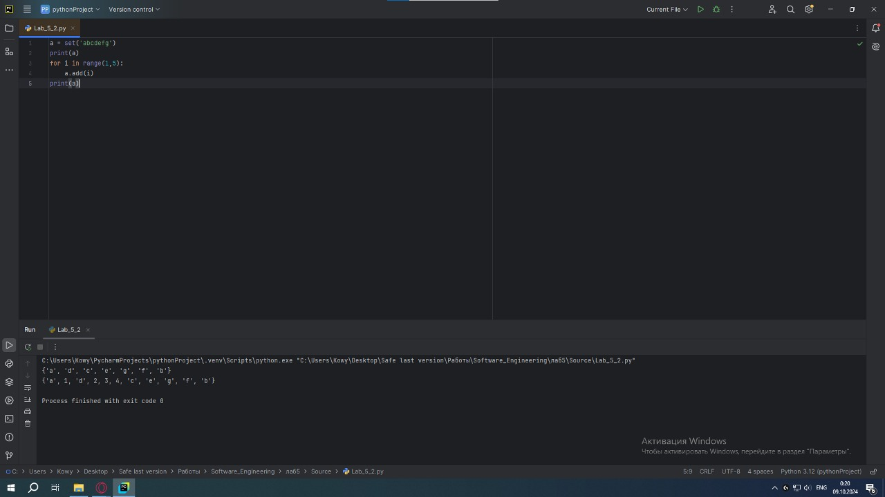
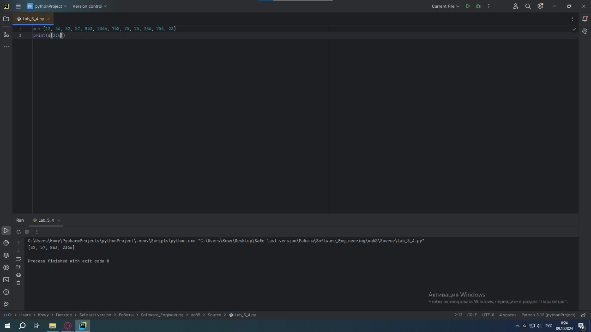
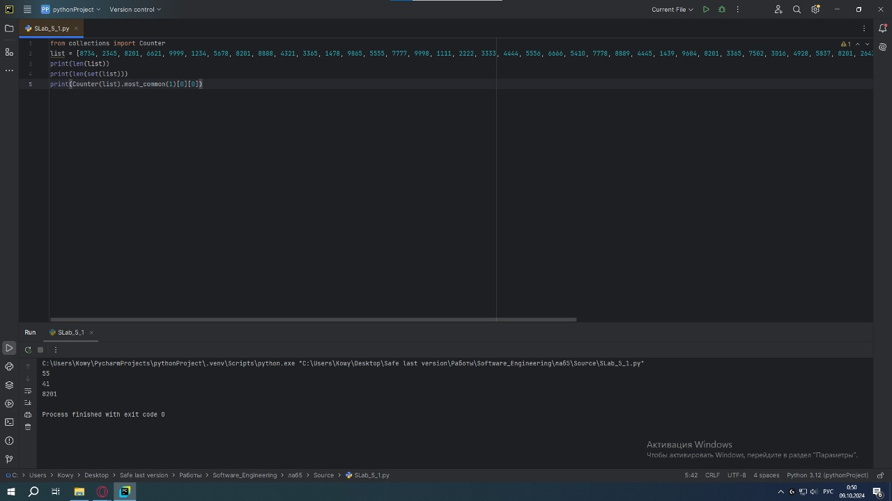
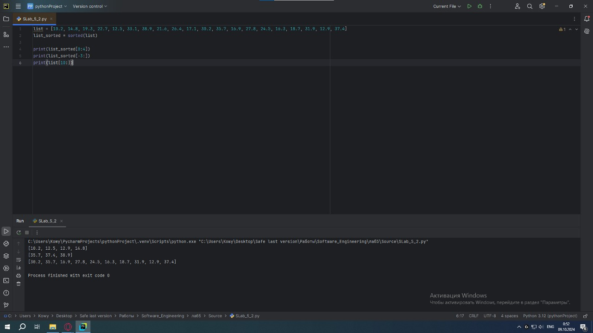

# Тема 6. Базовые коллекции: словари, кортежи
Отчет по Теме #6 выполнил(а):
- Кудренко Денис Валерьевич
- ИВТ-22-1

| Задание | Лаб_раб | Сам_раб |
| ------ | ------ |---------|
| Задание 1 | + | +       |
| Задание 2 | + | +       |
| Задание 3 | + | +       |
| Задание 4 | + | +       |
| Задание 5 | + | +       |

знак "+" - задание выполнено; знак "-" - задание не выполнено;

Работу проверили:
- к.э.н., доцент Панов М.А.

## Лабораторная работа №1
### В школе, где вы учились, узнали, что вы крутой программист и попросили написать программу для учителей, которая будет при вводе кабинета писать для него ключ доступа и статус, занят кабинет или нет. При написании программы необходимо использовать словарь (dict), который на вход получает номер кабинета, а выводит необходимую информацию. Если кабинета, который вы ввели нет в словаре, то в консоль в виде значения ключа нужно вывести “None” и виде статуса вывести “False”.

```
set_1 = {'White', 'Black', 'Red', 'Pink'}
set_2 = {'Red', 'Green', 'Blue', 'Red'}
print('1', set_1 - set_2)

set_1 = {'White', 'Black', 'Red', 'Pink'}
set_2 = {'Red', 'Green', 'Blue', 'Red'}
print('2', set_1 - set_2)

set_1 = {'White', 'Black', 'Red', 'Pink'}
set_2 = {'Red', 'Green', 'Blue', 'Red'}
print('3', set_1 - set_2)
```
### Результат.


## Выводы
Вывели все элементы первого множества, которых нет во втором

## Лабораторная работа №2
### Алексей решил создать самый большой словарь в мире. Для этого он придумал функцию dict_maker (**kwargs), которая принимает неограниченное количество параметров «ключ: значение» и обновляет Михаил А. Панов созданный им словарь my_dict, состоящий всего из одного элемента «first» со значением «so easy». Помогите Алексею создать данную функцию.

```python
a = set('abcdefg')
print(a)
for i in range(1,5):
    a.add(i)
print(a)
```
### Результат.


## Выводы
Научились использовать set() и frozenset()

## Лабораторная работа №3
### Для решения некоторых задач бывает необходимо разложить строку на отдельные символы. Мы знаем что это можно сделать при помощи split(), у которого более гибкая настройка для разделения для этого, но если нам нужно посимвольно разделить строку без всяких условий, то для этого мы можем использовать кортежи (tuple). Для этого напишем любую строку, которую будем делить и “обвернем” ее в tuple и дальше мы можем как нам угодно с ней работать, например, сделать ее списком (тогда получится полный аналог split()) или же работать с ним дальше, как с кортежем.

```python
def replace(input_list):
    memory = input_list[0]
    input_list[0] = input_list[-1]
    input_list[-1] = memory

    return  input_list
print(replace([1,2,3,4,5]))
```
### Результат.


## Выводы
Меняет первый и последний элемент списка местами

## Лабораторная работа №4
### Вовочка решил написать крутую функцию, которая будет писать имя, возраст и место работы, но при этом на вход этой функции будет поступать кортеж. Помогите Вовочке написать эту программу.
```python
a = [12, 54, 32, 57, 843, 2346, 765, 75, 25, 234, 756, 23]
print(a[2:6])
```
### Результат.


## Выводы
Выводит элементы с индексом 2,3,4,5,6

## Лабораторная работа №5
### Для сопровождения первых лиц государства X нужен кортеж, но никто не может определиться с порядком машин, поэтому вам нужно написать функцию, которая будет сортировать кортеж, состоящий из целых чисел по возрастанию, и возвращает его. Если хотя бы один элемент не является целым числом, то функция возвращает исходный кортеж.

```python
def useless(lst):
    return max(lst) / len(lst)
print(useless([3, 5, 7, 3, 33]))
print(useless([-12.5, 54, 77.3, 0, -36, 98.2, -63, 21.7, 47, -89.6]))
print(useless([-25.8, 86, 12.5, -56, 73.2, 0, 43, -91.5, 65.9, -7]))
```
### Результат.


## Выводы
Научились использовать useless()

## Самостоятельная работа №1
### Ресторан на предприятии ведет учет посещений за неделю при помощи кода работника. У них есть список со всеми посещениями за неделю. Ваша задача почитать: 
### • Сколько было выдано чеков 
### • Сколько разных людей посетило ресторан 
### • Какой работник посетил ресторан больше всех раз

```python
from collections import Counter
list = [8734, 2345, 8201, 6621, 9999, 1234, 5678, 8201, 8888, 4321, 3365, 1478, 9865, 5555, 7777, 9998, 1111, 2222, 3333, 4444, 5556, 6666, 5410, 7778, 8889, 4445, 1439, 9604, 8201, 3365, 7502, 3016, 4928, 5837, 8201, 2643, 5017, 9682, 8530, 3250, 7193, 9051, 4506, 1987, 3365, 5410, 7168, 7777, 9865, 5678, 8201, 4445, 3016, 4506, 4506]
print(len(list))
print(len(set(list)))
print(Counter(list).most_common(1)[0][0])
```
### Результат.


## Выводы
В первую очередь узнали количество элементов, после чего узнаем количество уникальных элементов и находим самое часто встречаемое число

## Самостоятельная работа №2
### На физкультуре студенты сдавали бег, у преподавателя физкультуры есть список всех результатов, ему нужно узнать 
### • Три лучшие результата 
### • Три худшие результата 
### • Все результаты начиная с 10

```python
list = [10.2, 14.8, 19.3, 22.7, 12.5, 33.1, 38.9, 21.6, 26.4, 17.1, 30.2, 35.7, 16.9, 27.8, 24.5, 16.3, 18.7, 31.9, 12.9, 37.4]
list_sorted = sorted(list)

print(list_sorted[0:4])
print(list_sorted[-3:])
print(list[10:])
```
### Результат.


## Выводы
Сделали обычную сортировку в списке, после чего вывели 3 лучших и 3 худших результата, а так-же 10 результатов отсортированных по времени

## Самостоятельная работа №3
### Преподаватель по математике придумал странную задачу. У вас есть три списка с элементами, каждый элемент которых – длина стороны треугольника, ваша задача найти площади двух треугольников, составленные из максимальных и минимальных элементов полученных списков. Результатом выполнения задачи будет: листинг кода, и вывод в консоль, в котором будут указаны два этих значения.

```python
from math import sqrt

one = [12, 25, 3, 48, 71]
two = [5, 18, 40, 62, 98]
three = [4, 21, 37, 56, 84]

mp = (max(one) + max(two) +max(three)) / 2
mip = (min(one) + min(two) +min(three)) / 2

max_square = sqrt(mp * (mp - max(one)) * (mp - max(two)) * (mp - max(three)))
min_square = sqrt(mip * (mip - min(one)) * (mip - min(two)) * (mip - min(three)))

print(max_square)
print(min_square)
```
### Результат.


## Выводы
Написали программу, согласно тексту задания 

## Самостоятельная работа №4
### Никто не любит получать плохие оценки, поэтому Борис решил это исправить. Допустим, что все оценки студента за семестр хранятся в одном списке. Ваша задача удалить из этого списка все двойки, а все тройки заменить на четверки.

```python
first = [2, 3, 4, 5, 3, 4, 5, 2, 2, 5, 3, 4, 3, 5, 4]
second = [4, 2, 3, 5, 3, 5, 4, 2, 2, 5, 4, 3, 5, 3, 4]
third = [5, 4, 3, 3, 4, 3, 3, 5, 5, 3, 3, 3, 3, 4, 4]

def modify_grades(grades):
    return [4 if grade == 3 else grade for grade in grades if grade != 2]

print(modify_grades(first))
print(modify_grades(second))
print(modify_grades(third))
```
### Результат.


## Выводы
Создаем новый список в котором заменяем все согласно условиям задачи

## Самостоятельная работа №5
### Вам предоставлены списки натуральных чисел, из них необходимо сформировать множества. При этом следует соблюдать это правило: если какое-либо число повторяется, то преобразовать его в строку по следующему образцу: например, если число 4 повторяется 3 раза, то в множестве будет следующая запись: само число 4, строка «44», строка «444».

```python
list_1 = [1, 1, 3, 3, 1]
list_2 = [5, 5, 5, 5, 5, 5, 5]
list_3 = [2, 2, 1, 2, 2, 5, 6, 7, 1, 3, 2, 2]


def list_to_set(lst):
    result_set = set()
    counts = {}

    for num in lst:
        counts[num] = counts.get(num, 0) + 1

    for num, count in counts.items():
        result_set.add(num)
        for i in range(2, count + 1):
            result_set.add(str(num) * i)

    return result_set

print(list_to_set(list_1))
print(list_to_set(list_2))
print(list_to_set(list_3))
```
### Результат.


## Выводы
Для начала узнаем количество числа в списке, после чего добавляем само число и добавляем строковое повторение
