# Тема 7. Работа с файлами (ввод, вывод)
Отчет по Теме #7 выполнил(а):
- Кудренко Денис Валерьевич
- ИВТ-22-1

| Задание | Лаб_раб | Сам_раб |
| ------ | ------ |---------|
| Задание 1 | + | +       |
| Задание 2 | + | +       |
| Задание 3 | + | +       |
| Задание 4 | + | +       |
| Задание 5 | + | +       |
| Задание 6 | + | -       |
| Задание 7 | + | -       |
| Задание 8 | + | -       |
| Задание 9 | + | -       |
| Задание 10 | + | -       |

знак "+" - задание выполнено; знак "-" - задание не выполнено;

Работу проверили:
- к.э.н., доцент Панов М.А.

## Лабораторная работа №1
### Составьте текстовый файл и положите его в одну директорию с программой на Python. Текстовый файл должен состоять минимум из двух строк.
### Результат.
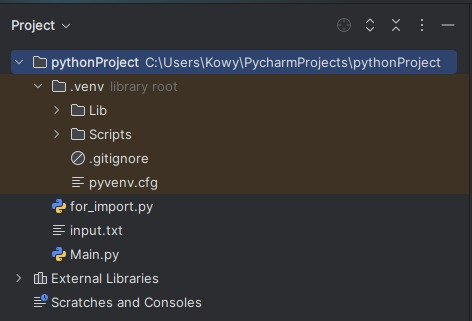

## Выводы
Добавили текстовый файл в директорию Python проекта

## Лабораторная работа №2
### Напишите программу, которая выведет только первую строку из вашего файла, при этом используйте конструкцию open()/close().

```python
f = open('input.txt', 'r')
print(f.readline())
f.close()
```
### Результат.
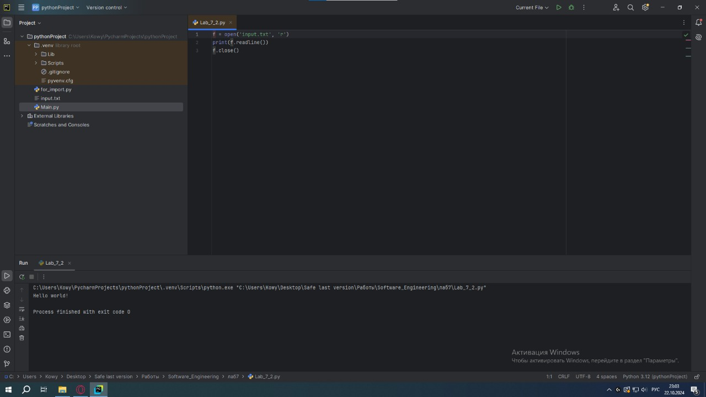

## Выводы
Научились открывать файл и читать из него строку

## Лабораторная работа №3
### Напишите программу, которая выведет все строки из вашего файла в массиве, при этом используйте конструкцию open()/close().

```python
f = open('input.txt', 'r')
print(f.readline())
f.close()
```
### Результат.
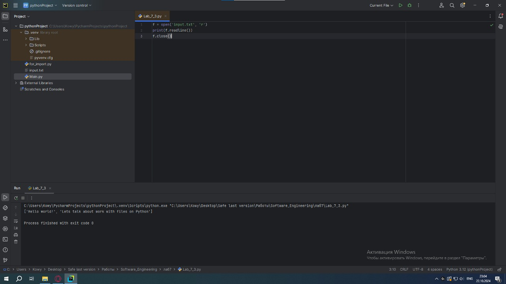

## Выводы
Научились открывать файл и читать из него все строки

## Лабораторная работа №4
### Напишите программу, которая выведет все строки из вашего файла в массиве, при этом используйте конструкцию with open().

```python
with open('input.txt') as f:
    print(f.readlines())
```
### Результат.
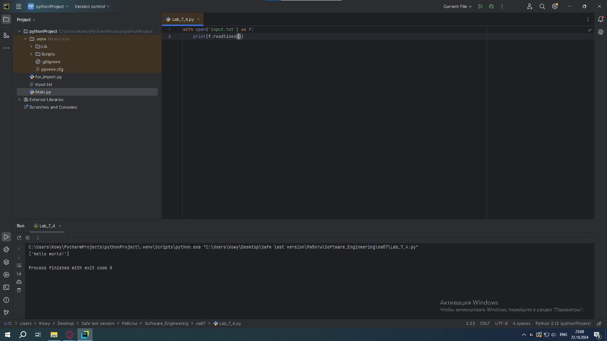

## Выводы
Дополнительный способ, который позволяет открывать файлы

## Лабораторная работа №5
### Напишите программу, которая выведет каждую строку из вашего файла отдельно, при этом используйте конструкцию with open().

```python
with open('input.txt') as f:
    for line in f:
        print(line)
```
### Результат.


## Выводы
Написали программу, которая так-же читает все строки в файле, только через второй способ

## Лабораторная работа №6
### Напишите программу, которая будет добавлять новую строку в ваш файл, а потом выведет полученный файл в консоль. Вывод можно осуществлять любым способом. Обязательно проверьте сам файл, чтобы изменения в нем тоже отображались.

```python
with open('input.txt', 'a+') as f:
    f.write('\nIm additional line')
with open('input.txt', 'r') as f:
    result = f.readlines()
    print(result)
```
### Результат.
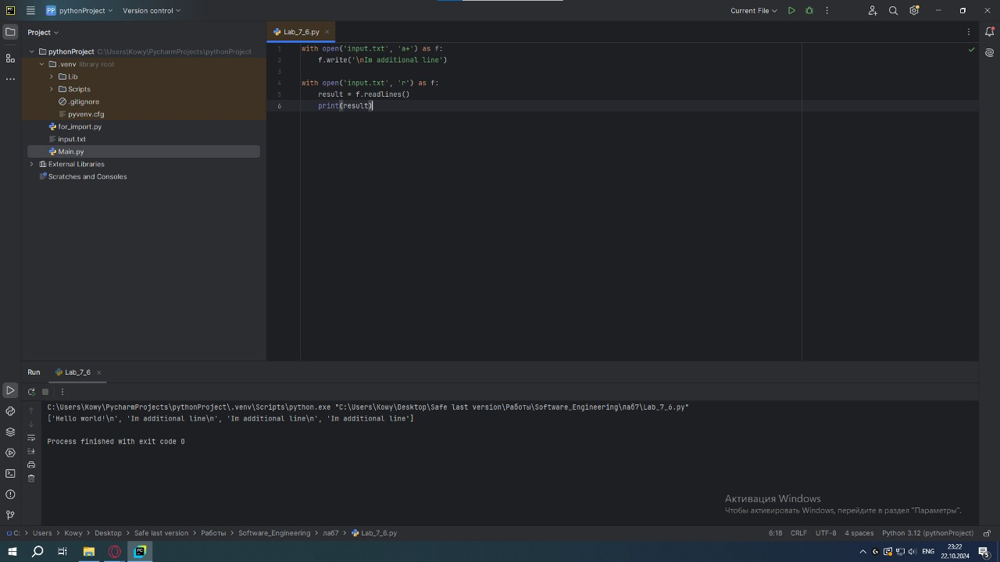

## Выводы
Научились добавлять строки и читать строки в готовый файл

## Лабораторная работа №7
### Напишите программу, которая перепишет всю информацию, которая была у вас в файле до этого, например напишет любые данные из произвольно вами составленного списка. Также не забудьте проверить что измененная вами информация сохранилась в файле.

```python
lines = ['one', 'two', 'three']
with open('input.txt', 'w') as f:
    for line in lines:
        f.write('\nCycle run ' + line)
    print('Done!')
```
### Результат.
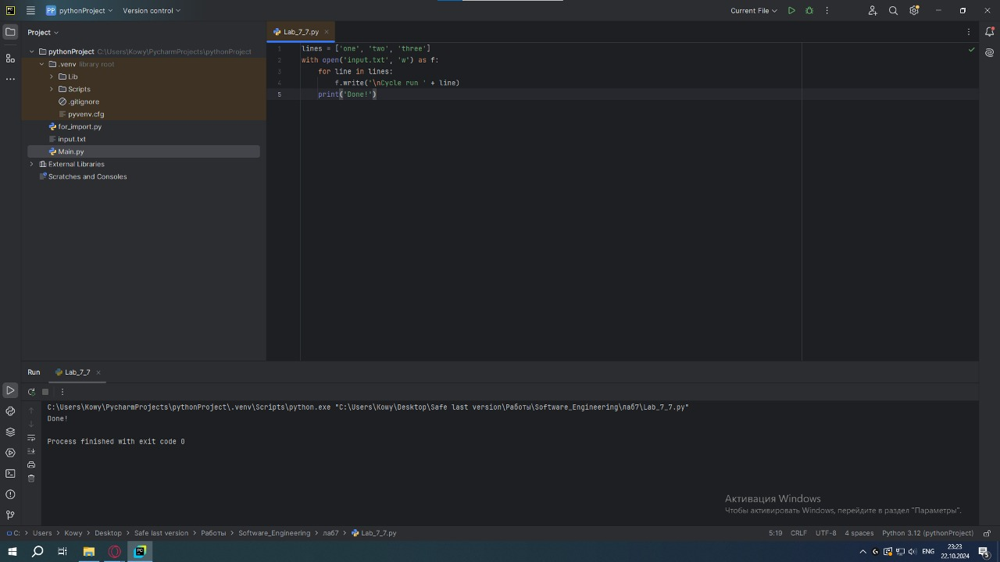

## Выводы
Научились перезаписывать файл

## Лабораторная работа №8
### Выберите любую папку на своем компьютере, имеющую вложенные директории. Выведите на печать в терминал ее содержимое, как и всех подкаталогов при помощи функции print_docs(directory).

```python
import os
def print_docs(directory):
    all_files = os.walk(directory)
    for catalog in all_files:
        print(f'Папка {catalog[0]} содержит:')
    print(f'Директории: {", ".join([folder for folder in catalog[1]])}')
    print(f'Файлы: {", ".join([file for file in catalog[2]])}')
    print('-' * 48)

print_docs('C:')
```
### Результат.
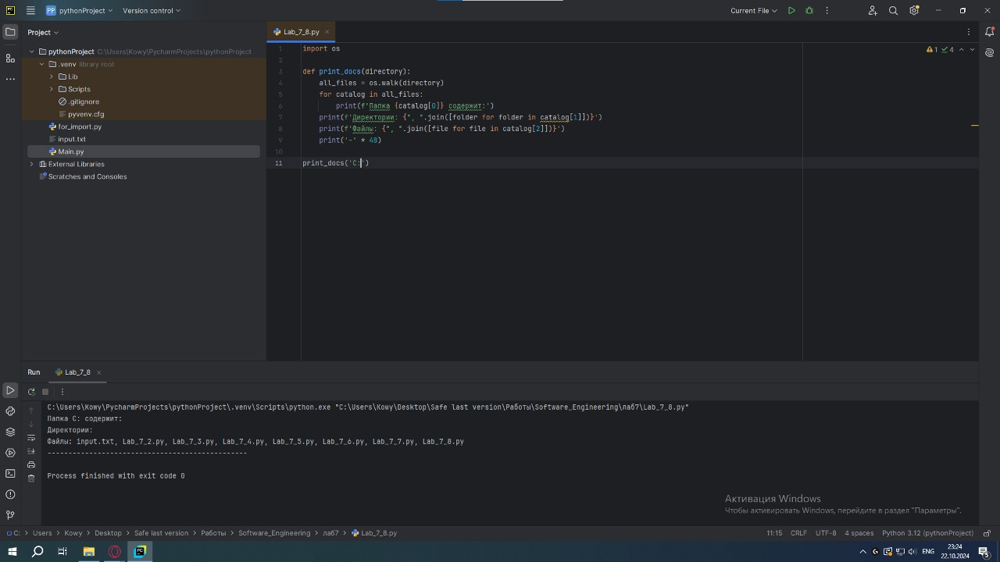

## Выводы
Научились проходить и выводить данные из директорий

## Лабораторная работа №9
### Требуется реализовать функцию, которая выводит слово, имеющее максимальную длину (или список слов, если таковых несколько). Проверьте работоспособность программы на своем наборе данных.
```python
def longest_words(file):
    with open(file, encoding='utf-8') as f:
        words = f.read().split()
        max_length = len(max(words, key=len))
        for word in words:
            if len(word) == max_length:
                sought_words = word

        if len(sought_words) == 1:
            return sought_words[0]
        return sought_words
print(longest_words('input.txt'))
```
### Результат.
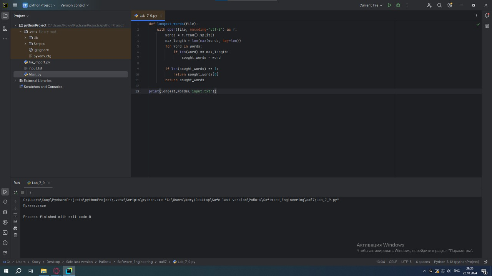

## Выводы
Написали программу, которая позволяет выводить самое длинное слово из файла

## Лабораторная работа №10
### Требуется создать csv-файл «rows_300.csv» со следующими столбцами: 
### • № - номер по порядку (от 1 до 300);
### • Секунда – текущая секунда на вашем ПК; 
### • Микросекунда – текущая миллисекунда на часах.

```python
import csv
import datetime
import time
with open('rows_300.csv', 'w', encoding='utf-8', newline='') as f:
    writer = csv.writer(f)
    writer.writerow(['№', 'Секунда', 'Микросекунда'])
    for line in range(1, 301):
        writer.writerow([line, datetime.datetime.now().second,
                         datetime.datetime.now().microsecond])
        time.sleep(0.01)
```
### Результат.
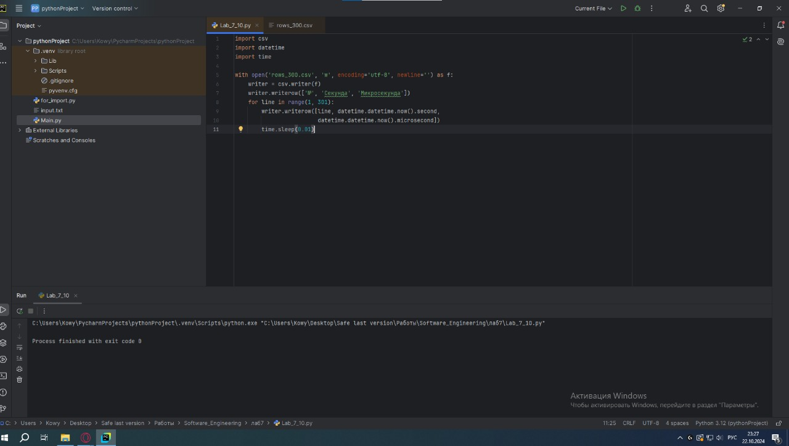

## Выводы
Создали rows_300.csv, согласно условиям в задании

## Самостоятельная работа №1
### Найдите в интернете любую статью (объем статьи не менее 200 слов), скопируйте ее содержимое в файл и напишите программу, которая считает количество слов в текстовом файле и определит самое часто встречающееся слово. Результатом выполнения задачи будет: скриншот файла со статьей, листинг кода, и вывод в консоль, в котором будет указана вся необходимая информация.
```python
from collections import Counter
import re
def count_words_in_file(filename):
    with open(filename, 'r', encoding='utf-8') as file:
        text = file.read().lower()
        words = re.findall(r'\b\w+\b', text)
        word_count = Counter(words)
        most_common_word = word_count.most_common(1)[0]
    return len(words), most_common_word
total_words, most_common_word = count_words_in_file("input.txt")
print(f"Общее количество слов: {total_words}")
print(f"Самое частое слово: '{most_common_word[0]}', количество вхождений: {most_common_word[1]}")
```
### Результат.
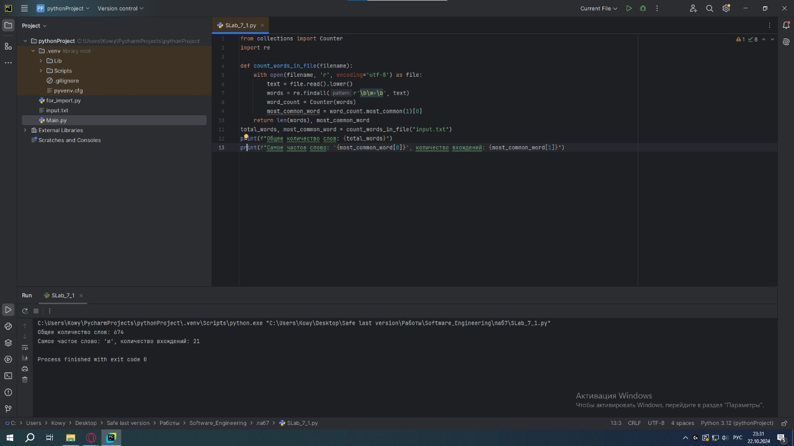

## Выводы
Написали программу, которая подсчитывает общее количество слов и так-же находит и выводит самое частое слово из текста

## Самостоятельная работа №2
### У вас появилась потребность в ведении книги расходов, посмотрев все существующие варианты вы пришли к выводу что вас ничего не устраивает и нужно все делать самому. Напишите программу для учета расходов. Программа должна позволять вводить информацию о расходах, сохранять ее в файл и выводить существующие данные в консоль. Ввод информации происходит через консоль. Результатом выполнения задачи будет: скриншот файла с учетом расходов, листинг кода, и вывод в консоль, с демонстрацией работоспособности программы.

```python
import csv
import os
FILENAME = 'expenses.csv'
def add_expense(date, amount, category, description):
    with open(FILENAME, mode='a', newline='') as file:
        writer = csv.writer(file)
        writer.writerow([date, amount, category, description])
def display_expenses():
    if not os.path.exists(FILENAME):
        print("Файл с расходами не найден.")
        return
    with open(FILENAME, mode='r') as file:
        reader = csv.reader(file)
        print("Данные о расходах:")
        for row in reader:
            print(f"Дата: {row[0]}, Сумма: {row[1]}, Категория: {row[2]}, Описание: {row[3]}")
def main():
    while True:
        print("\n1. Добавить расход")
        print("2. Показать расходы")
        print("3. Выход")
        choice = input("Выберите опцию: ")
        if choice == '1':
            date = input("Введите дату (ГГГГ-ММ-ДД): ")
            amount = float(input("Введите сумму: "))
            category = input("Введите категорию: ")
            description = input("Введите описание: ")
            add_expense(date, amount, category, description)
            print("Расход успешно добавлен.")
        elif choice == '2':
            display_expenses()
        elif choice == '3':
            print("Выход из программы.")
            break
        else:
            print("Неверный ввод. Пожалуйста, выберите еще раз.")
if __name__ == "__main__":
    main()
```
### Результат.
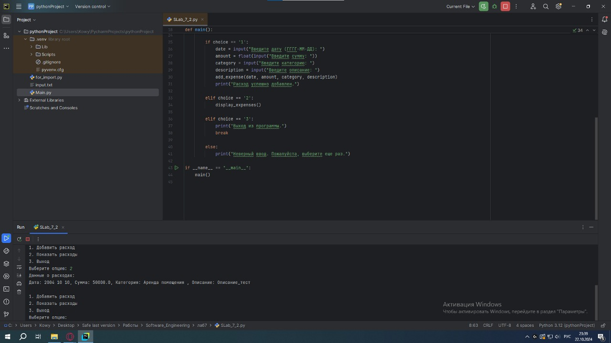

## Выводы
Написали программу, которая записывают в отдельный файл ваши расходы, которые потом можно просмотреть

## Самостоятельная работа №3
### Имеется файл input.txt с текстом на латинице. Напишите программу, которая выводит следующую статистику по тексту: количество букв латинского алфавита; число слов; число строк.
```python
import re
def text_statistics(filename):
    with open(filename, 'r', encoding='utf-8') as file:
        lines = file.readlines()
        num_lines = len(lines)
        num_words = 0
        num_letters = 0
        for line in lines:
            words = line.split()
            num_words += len(words)
            num_letters += len(re.findall(r'[a-zA-Z]', line))

        print(f"Количество букв латинского алфавита: {num_letters}")
        print(f"Количество слов: {num_words}")
        print(f"Количество строк: {num_lines}")
text_statistics("input.txt")
```
### Результат.
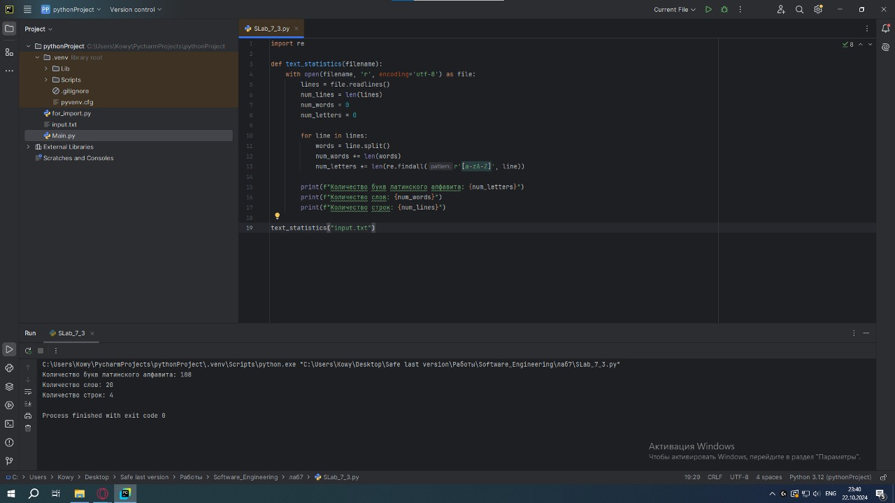

## Выводы
Написали программу, согласно тексту задания 

## Самостоятельная работа №4
### Напишите программу, которая получает на вход предложение, выводит его в терминал, заменяя все запрещенные слова звездочками * (количество звездочек равно количеству букв в слове). Запрещенные слова, разделенные символом пробела, хранятся в текстовом файле input.txt. Все слова в этом файле записаны в нижнем регистре. Программа должна заменить запрещенные слова, где бы они ни встречались, даже

```python
import re
def load_forbidden_words(filename):
    with open(filename, 'r', encoding='utf-8') as file:
        forbidden_words = file.read().split()
    return forbidden_words
def censor_sentence(sentence, forbidden_words):
    for word in forbidden_words:
        pattern = re.compile(re.escape(word), re.IGNORECASE)
        sentence = pattern.sub('*' * len(word), sentence)
    return sentence
forbidden_words = load_forbidden_words("input.txt")
sentence = input("Введите предложение для проверки: ")
censored_sentence = censor_sentence(sentence, forbidden_words)
print("Результат:", censored_sentence)
```
### Результат.
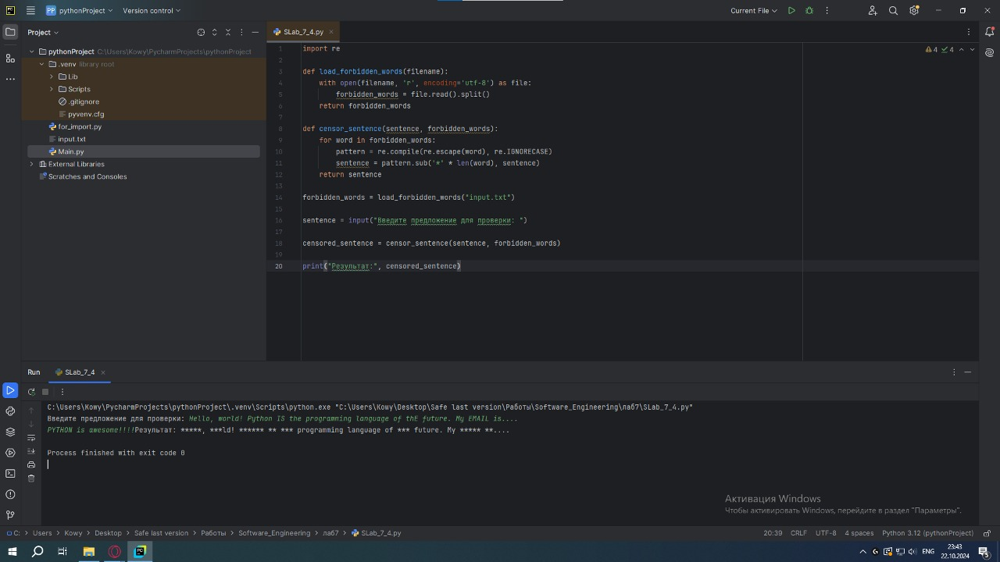

## Выводы
Написали программу, которая берет запрещнные слова из файлика и заменяют их *

## Самостоятельная работа №5
### Самостоятельно придумайте и решите задачу, которая будет взаимодействовать с текстовым файлом.

```python
FILENAME = 'books.txt'
def main():
    books = []
    while True:
        choice = input("1. Добавить книгу\n2. Показать книги\n3. Выход\nВыберите опцию: ")
        if choice == '1':
            book = input("Введите название книги: ")
            books.append(book)
            with open(FILENAME, 'a') as f: f.write(book + '\n')
        elif choice == '2':
            with open(FILENAME, 'r') as f: print(f.read())
        elif choice == '3':
            break
        else:
            print("Неверный ввод.")
if __name__ == "__main__": main()
```
### Результат.
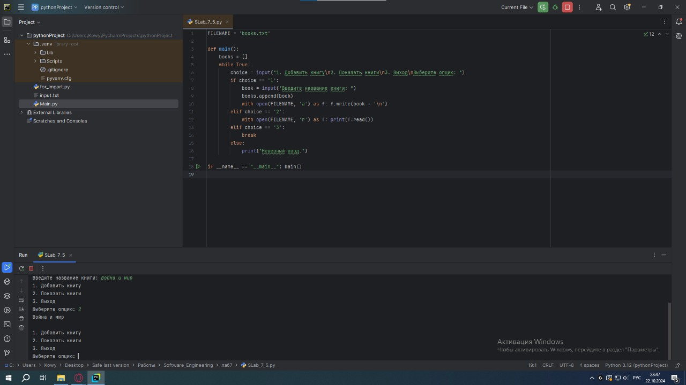

## Выводы
Написал программу, которая позволяет сохранять в файл, название книги, которую вы прочитали
