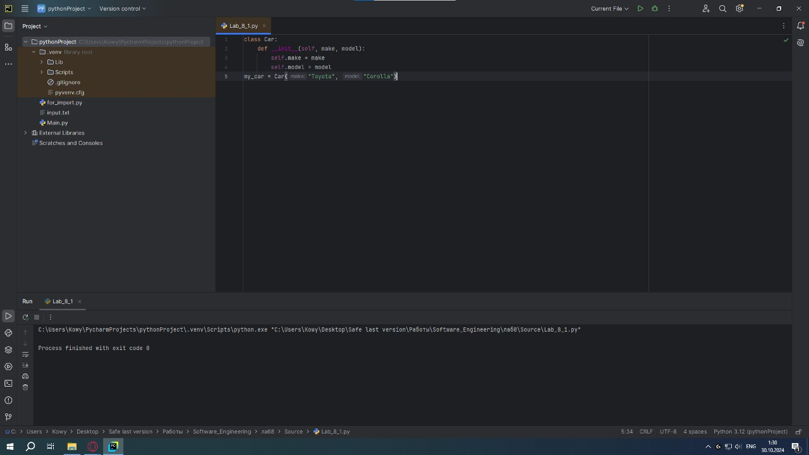
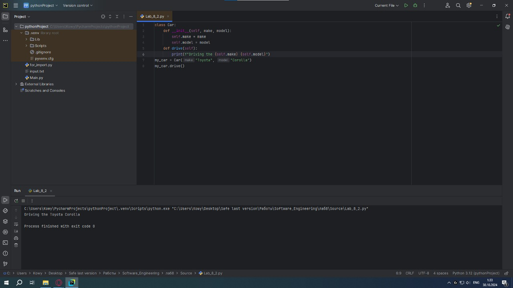
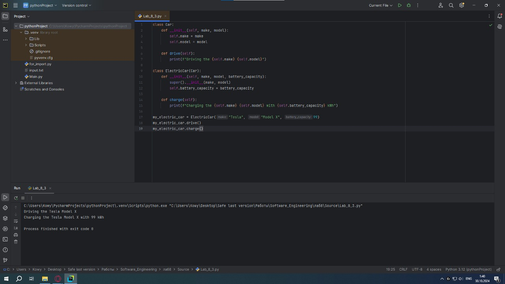
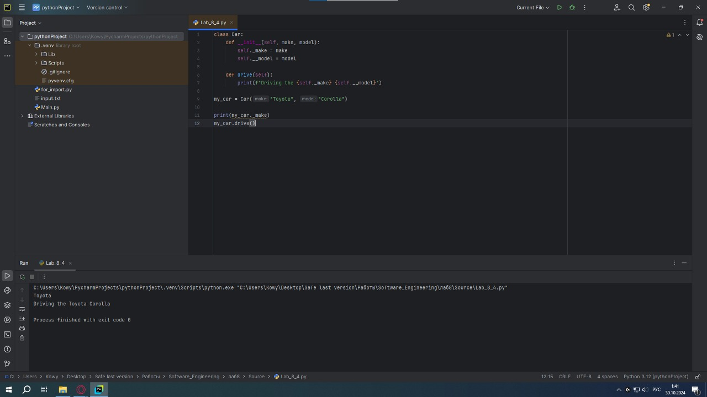
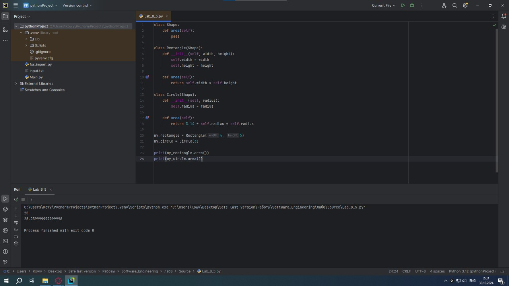
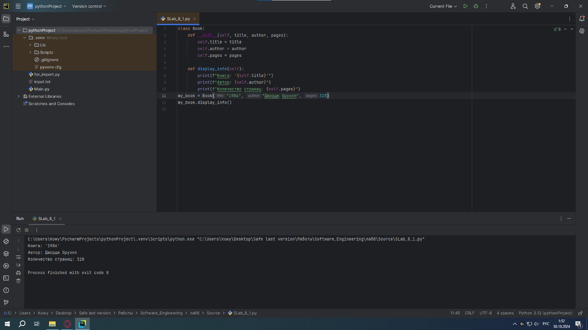
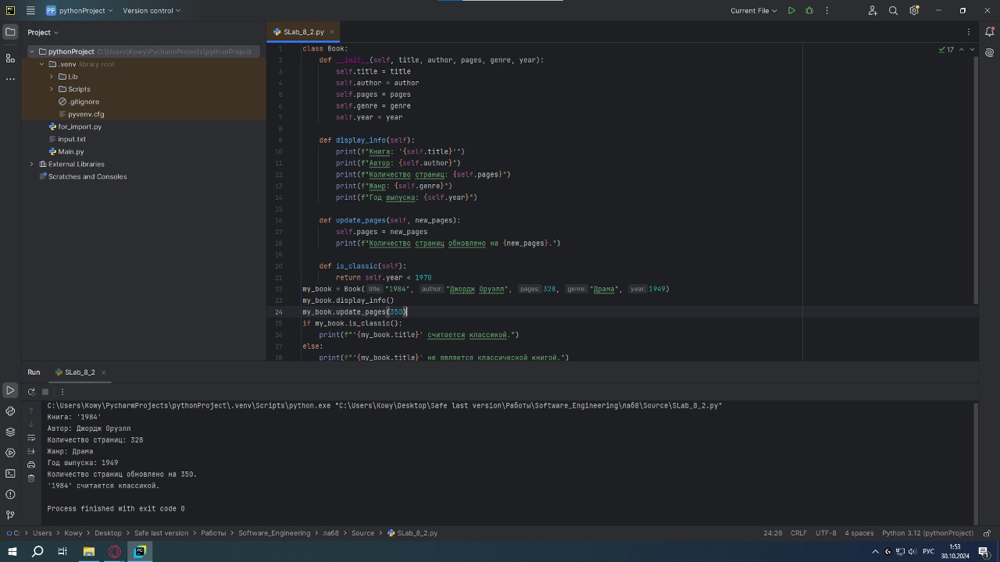
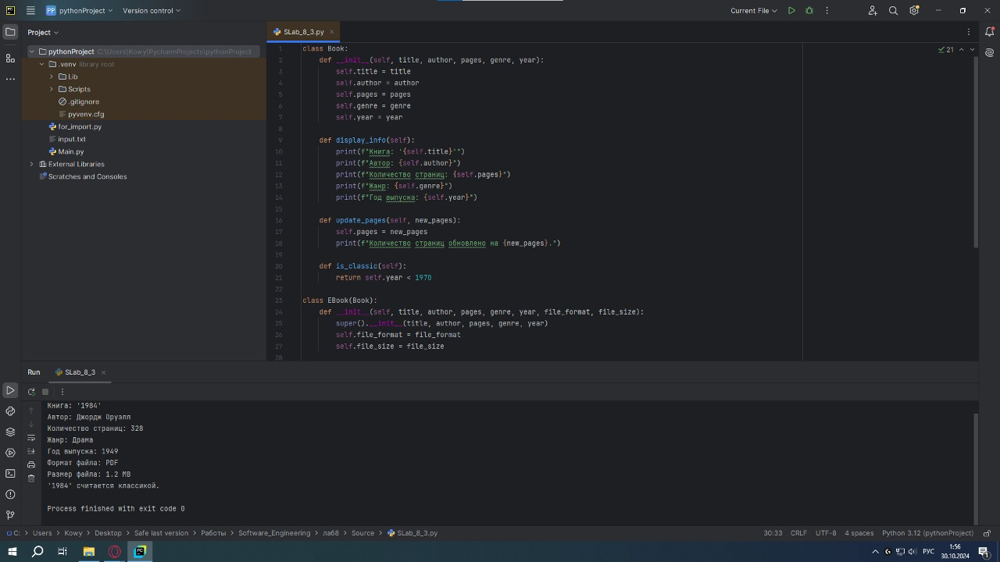
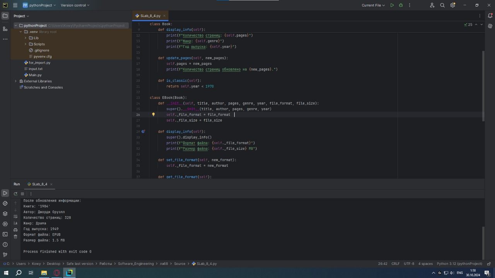
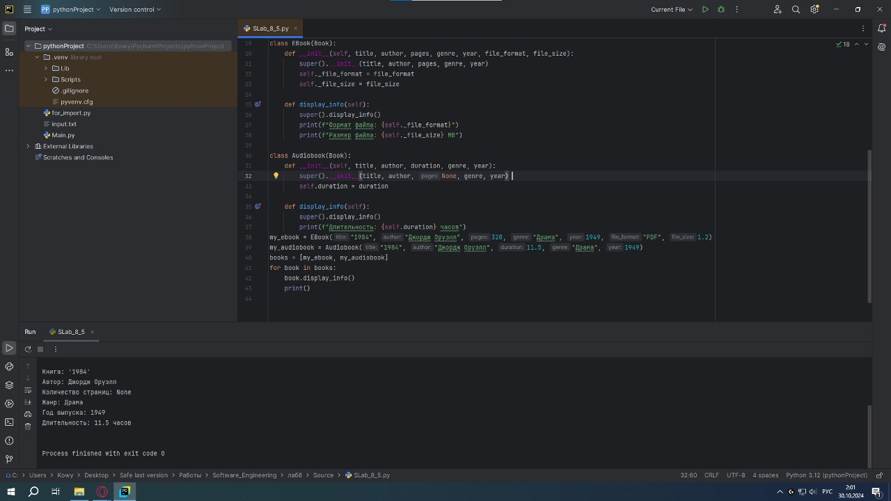

# Тема 8. Введение в ООП
Отчет по Теме #8 выполнил(а):
- Кудренко Денис Валерьевич
- ИВТ-22-1

| Задание | Лаб_раб | Сам_раб |
| ------ | ------ |---------|
| Задание 1 | + | +       |
| Задание 2 | + | +       |
| Задание 3 | + | +       |
| Задание 4 | + | +       |
| Задание 5 | + | +       |

знак "+" - задание выполнено; знак "-" - задание не выполнено;

Работу проверили:
- к.э.н., доцент Панов М.А.

## Лабораторная работа №1
### Создайте класс “Car” с атрибутами производитель и модель. Создайте объект этого класса. Напишите комментарии для кода, объясняющие его работу. Результатом выполнения задания будет листинг кода с комментариями.
```python
class Car:
    def __init__(self, make, model):
        self.make = make
        self.model = model
my_car = Car("Toyota", "Corolla")
```
### Результат.


## Выводы
Создали новый класс "Car"

## Лабораторная работа №2
### Дополните код из первого задания, добавив в него атрибуты и методы класса, заставьте машину “поехать”. Напишите комментарии для кода, объясняющие его работу. Результатом выполнения задания будет листинг кода с комментариями и получившийся вывод в консоль.

```python
class Car:
    def __init__(self, make, model):
        self.make = make
        self.model = model
    def drive(self):
        print(f"Driving the {self.make} {self.model}")
my_car = Car("Toyota", "Corolla")
my_car.drive()
```
### Результат.


## Выводы
Добавили атрибуты и метод класса.

## Лабораторная работа №3
### Создайте новый класс “ElectricCar” с методом “charge” и атрибутом емкость батареи. Реализуйте его наследование от класса, созданного в первом задании. Заставьте машину поехать, а потом заряжаться. Результатом выполнения задания будет листинг кода с комментариями и получившийся вывод в консоль.

```python
class Car:
    def __init__(self, make, model):
        self.make = make
        self.model = model

    def drive(self):
        print(f"Driving the {self.make} {self.model}")

class ElectricCar(Car):
    def __init__(self, make, model, battery_capacity):
        super().__init__(make, model)
        self.battery_capacity = battery_capacity

    def charge(self):
        print(f"Charging the {self.make} {self.model} with {self.battery_capacity} kWh")

my_electric_car = ElectricCar("Tesla", "Model X", 99)
my_electric_car.drive()
my_electric_car.charge()
```
### Результат.


## Выводы
Создали класс с методом.

## Лабораторная работа №4
### Реализуйте инкапсуляцию для класса, созданного в первом задании. Создайте защищенный атрибут производителя и приватный атрибут модели. Вызовите защищенный атрибут и заставьте машину поехать. Напишите комментарии для кода, объясняющие его работу. Результатом выполнения задания будет листинг кода с комментариями и получившийся вывод в консоль.

```python
class Car:
    def __init__(self, make, model):
        self._make = make
        self.__model = model

    def drive(self):
        print(f"Driving the {self._make} {self.__model}")

my_car = Car("Toyota", "Corolla")

print(my_car._make)
my_car.drive()
```
### Результат.


## Выводы
Реализовали принцип инкапсуляции.

## Лабораторная работа №5
### Реализуйте полиморфизм создав основной (общий) класс “Shape”, а также еще два класса “Rectangle” и “Circle”. Внутри последних двух классов реализуйте методы для подсчета площади фигуры. После этого создайте массив с фигурами, поместите туда круг и прямоугольник, затем при помощи цикла выведите их площади. Напишите комментарии для кода, объясняющие его работу. Результатом выполнения задания будет листинг кода с комментариями и получившийся вывод в консоль.

```python
class Shape:
    def area(self):
        pass

class Rectangle(Shape):
    def __init__(self, width, height):
        self.width = width
        self.height = height

    def area(self):
        return self.width * self.height

class Circle(Shape):
    def __init__(self, radius):
        self.radius = radius

    def area(self):
        return 3.14 * self.radius * self.radius

my_rectangle = Rectangle(4, 5)
my_circle = Circle(3)

print(my_rectangle.area())
print(my_circle.area())
```
### Результат.


## Выводы
Реализовали принцип полиморфизма.

## Самостоятельная работа №1
### Самостоятельно создайте класс и его объект. Они должны отличаться, от тех, что указаны в теоретическом материале (методичке) и лабораторных заданиях. Результатом выполнения задания будет листинг кода и получившийся вывод консоли.

```python
class Book:
    def __init__(self, title, author, pages):
        self.title = title
        self.author = author
        self.pages = pages

    def display_info(self):
        print(f"Книга: '{self.title}'")
        print(f"Автор: {self.author}")
        print(f"Количество страниц: {self.pages}")
my_book = Book("1984", "Джордж Оруэлл", 328)
my_book.display_info()
```
### Результат.


## Выводы
Создали класс и объект, который относится к этому классу.

## Самостоятельная работа №2
### Самостоятельно создайте атрибуты и методы для ранее созданного класса. Они должны отличаться, от тех, что указаны в теоретическом материале (методичке) и лабораторных заданиях. Результатом выполнения задания будет листинг кода и получившийся вывод консоли.
```python
class Book:
    def __init__(self, title, author, pages, genre, year):
        self.title = title
        self.author = author
        self.pages = pages
        self.genre = genre
        self.year = year

    def display_info(self):
        print(f"Книга: '{self.title}'")
        print(f"Автор: {self.author}")
        print(f"Количество страниц: {self.pages}")
        print(f"Жанр: {self.genre}")
        print(f"Год выпуска: {self.year}")

    def update_pages(self, new_pages):
        self.pages = new_pages
        print(f"Количество страниц обновлено на {new_pages}.")

    def is_classic(self):
        return self.year < 1970
my_book = Book("1984", "Джордж Оруэлл", 328, "Драма", 1949)
my_book.display_info()
my_book.update_pages(350)
if my_book.is_classic():
    print(f"'{my_book.title}' считается классикой.")
else:
    print(f"'{my_book.title}' не является классической книгой.")
```
### Результат.


## Выводы
Создали атрибуты и методы для созданного класса.

## Самостоятельная работа №3
### Самостоятельно реализуйте наследование, продолжая работать с ранее созданным классом. Оно должно отличаться, от того, что указано в теоретическом материале (методичке) и лабораторных заданиях. Результатом выполнения задания будет листинг кода и получившийся вывод консоли.

```python
class Book:
    def __init__(self, title, author, pages, genre, year):
        self.title = title
        self.author = author
        self.pages = pages
        self.genre = genre
        self.year = year

    def display_info(self):
        print(f"Книга: '{self.title}'")
        print(f"Автор: {self.author}")
        print(f"Количество страниц: {self.pages}")
        print(f"Жанр: {self.genre}")
        print(f"Год выпуска: {self.year}")

    def update_pages(self, new_pages):
        self.pages = new_pages
        print(f"Количество страниц обновлено на {new_pages}.")

    def is_classic(self):
        return self.year < 1970

class EBook(Book):
    def __init__(self, title, author, pages, genre, year, file_format, file_size):
        super().__init__(title, author, pages, genre, year)
        self.file_format = file_format
        self.file_size = file_size

    def display_info(self):
        super().display_info()
        print(f"Формат файла: {self.file_format}")
        print(f"Размер файла: {self.file_size} MB")
my_ebook = EBook("1984", "Джордж Оруэлл", 328, "Драма", 1949, "PDF", 1.2)
my_ebook.display_info()
if my_ebook.is_classic():
    print(f"'{my_ebook.title}' считается классикой.")
else:
    print(f"'{my_ebook.title}' не является классической книгой.")
```
### Результат.


## Выводы
Реализовали принцип наследования.

## Самостоятельная работа №4
### Самостоятельно реализуйте инкапсуляцию, продолжая работать с ранее созданным классом. Она должна отличаться, от того, что указана в теоретическом материале (методичке) и лабораторных заданиях. Результатом выполнения задания будет листинг кода и получившийся вывод консоли.

```python
class Book:
    def __init__(self, title, author, pages, genre, year):
        self.title = title
        self.author = author
        self.pages = pages
        self.genre = genre
        self.year = year

    def display_info(self):
        print(f"Книга: '{self.title}'")
        print(f"Автор: {self.author}")
        print(f"Количество страниц: {self.pages}")
        print(f"Жанр: {self.genre}")
        print(f"Год выпуска: {self.year}")

    def update_pages(self, new_pages):
        self.pages = new_pages
        print(f"Количество страниц обновлено на {new_pages}.")

    def is_classic(self):
        return self.year < 1970

class EBook(Book):
    def __init__(self, title, author, pages, genre, year, file_format, file_size):
        super().__init__(title, author, pages, genre, year)
        self._file_format = file_format
        self._file_size = file_size

    def display_info(self):
        super().display_info()
        print(f"Формат файла: {self._file_format}")
        print(f"Размер файла: {self._file_size} MB")

    def set_file_format(self, new_format):
        self._file_format = new_format

    def get_file_format(self):
        return self._file_format

    def set_file_size(self, new_size):
        if new_size > 0:
            self._file_size = new_size
        else:
            print("Размер файла должен быть больше нуля.")

    def get_file_size(self):
        return self._file_size
my_ebook = EBook("1984", "Джордж Оруэлл", 328, "Драма", 1949, "PDF", 1.2)
my_ebook.display_info()
my_ebook.set_file_format("EPUB")
my_ebook.set_file_size(1.5)
print("\nПосле обновления информации:")
my_ebook.display_info()
```
### Результат.


## Выводы
Реализовали принцип инкапсуляции.

## Самостоятельная работа №5
### Самостоятельно реализуйте полиморфизм. Он должен отличаться, от того, что указан в теоретическом материале (методичке) и лабораторных заданиях. Результатом выполнения задания будет листинг кода и получившийся вывод консоли

```python
class Book:
    def __init__(self, title, author, pages, genre, year):
        self.title = title
        self.author = author
        self.pages = pages
        self.genre = genre
        self.year = year

    def display_info(self):
        print(f"Книга: '{self.title}'")
        print(f"Автор: {self.author}")
        print(f"Количество страниц: {self.pages}")
        print(f"Жанр: {self.genre}")
        print(f"Год выпуска: {self.year}")

    def is_classic(self):
        return self.year < 1970

class EBook(Book):
    def __init__(self, title, author, pages, genre, year, file_format, file_size):
        super().__init__(title, author, pages, genre, year)
        self._file_format = file_format
        self._file_size = file_size

    def display_info(self):
        super().display_info()
        print(f"Формат файла: {self._file_format}")
        print(f"Размер файла: {self._file_size} MB")

class Audiobook(Book):
    def __init__(self, title, author, duration, genre, year):
        super().__init__(title, author, None, genre, year)
        self.duration = duration

    def display_info(self):
        super().display_info()
        print(f"Длительность: {self.duration} часов")
my_ebook = EBook("1984", "Джордж Оруэлл", 328, "Драма", 1949, "PDF", 1.2)
my_audiobook = Audiobook("1984", "Джордж Оруэлл", 11.5, "Драма", 1949)
books = [my_ebook, my_audiobook]
for book in books:
    book.display_info()
    print()
```
### Результат.


## Выводы
Реализовали принцип полиморфизма.
